---
# Please do not edit this file directly; it is auto generated.
# Instead, please edit 01-continuous-data.md in _episodes_rmd/
title: "Visualising continuous data with ggplot2"
teaching: 60
exercises: 30
questions:
  - "What are the components of a ggplot?"
  - "How do I create histograms, density plots, and scatterplots?"
  - "How can I change the aesthetics (ex. colour, transparency) of my plot?"
objectives:
   - "Produce histograms, density plots and scatterplots using ggplot."
   - "Set universal plot settings."
keypoints:
   - "`ggplot2` is a flexible and useful tool for creating plots in R."
   - "The data set and coordinate system can be defined using the `ggplot` function."
   - "Additional layers, including geoms, are added using the `+` operator."
   - "Histograms and density plots are useful tools to visualise the distribution a a continuous variable."
   - "Scatterplots can be useful in understanding the relationship between two continuous variables."
---


We start by loading the required package. **`ggplot2`** is also included in the
**`tidyverse`** package.


~~~
library(tidyverse)
~~~
{: .language-r}

The data is available as part of the project you cloned from GitHub during
the previous lesson. Switch to that project now if you haven't opened it
in RStudio already.


~~~
interviews_plotting <- read_csv("data_output/interviews_plotting.csv")
~~~
{: .language-r}


~~~
Parsed with column specification:
cols(
  .default = col_logical(),
  key_ID = col_integer(),
  village = col_character(),
  interview_date = col_datetime(format = ""),
  no_membrs = col_integer(),
  years_liv = col_integer(),
  respondent_wall_type = col_character(),
  rooms = col_integer(),
  memb_assoc = col_character(),
  affect_conflicts = col_character(),
  liv_count = col_integer(),
  items_owned = col_character(),
  no_meals = col_integer(),
  months_lack_food = col_character(),
  instanceID = col_character(),
  number_month_lack_food = col_integer(),
  number_items = col_integer()
)
~~~
{: .output}


~~~
See spec(...) for full column specifications.
~~~
{: .output}

Before we proceed to plot the data, let's take a quick look at what we
just loaded.


~~~
View(interviews_plotting)
~~~
{: .language-r}

## Plotting with **`ggplot2`**

**`ggplot2`** is a plotting package that makes it simple to create complex plots
from data stored in a data frame. It provides a programmatic interface for
specifying what variables to plot, how they are displayed, and general visual
properties. Therefore, we only need minimal changes if the underlying data
change or if we decide to change from a bar plot to a scatterplot. This helps in
creating publication quality plots with minimal amounts of adjustments and
tweaking.

**`ggplot2`** functions like data in the 'long' format, i.e., a column for every
dimension, and a row for every observation. Well-structured data will save you
lots of time when making figures with **`ggplot2`**

ggplot graphics are built step by step by adding new elements. Adding layers in
this fashion allows for extensive flexibility and customization of plots.

To build a ggplot, we will use the following basic template that can be used for different types of plots:

```
ggplot(data = <DATA>, mapping = aes(<MAPPINGS>)) +  <GEOM_FUNCTION>()
```

- use the `ggplot()` function and bind the plot to a specific data frame using
  the `data` argument


~~~
ggplot(data = interviews_plotting)
~~~
{: .language-r}

- define a mapping (using the aesthetic (`aes`) function), by selecting the variables to be plotted
  and specifying how to present them in the graph, e.g. as x/y positions or characteristics such as
  size, shape, color, etc.

> ## Exercise
> 
> We would like to inspect the data for a potential relationship between the number of
> people living in a household (`no_members`) and the number of items owned by that
> household (`number_items`). What would be a good way to visualise these data?
>
> > ## Solution
> >
> > Since we are dealing with two continuous variables, a scatterplot seems like
> > a good starting point. However, both of these variables only take a relatively
> > small number of discrete values. Under these circumstances a scatterplot may
> > be problematic. Let's take a look.
> {: .solution}
{: .challenge}


~~~
ggplot(data = interviews_plotting, aes(x = no_membrs, y = number_items))
~~~
{: .language-r}

- add 'geoms' – graphical representations of the data in the plot (points,
lines, bars). **`ggplot2`** offers many different geoms; we will use some
common ones today, including:

* `geom_point()` for scatter plots, dot plots, etc.
* `geom_boxplot()` for, well, boxplots!
* `geom_line()` for trend lines, time series, etc.

To add a geom to the plot use the `+` operator. To create a scatterplot we
want the data to be represented as points, which can be achieved with `geom_point()`:


~~~
ggplot(data = interviews_plotting, aes(x = no_membrs, y = number_items)) +
    geom_point()
~~~
{: .language-r}


The `+` in the **`ggplot2`** package is particularly useful because it allows
you to modify existing `ggplot` objects. This means you can easily set up plot
templates and conveniently explore different types of plots, so the above plot
can also be generated with code like this:


~~~
# Assign plot to a variable
interviews_plot <- ggplot(data = interviews_plotting, aes(x = no_membrs, y = number_items))

# Draw the plot
interviews_plot +
    geom_point()
~~~
{: .language-r}

> ## Notes
>
> - Anything you put in the `ggplot()` function can be seen by any geom layers
>   that you add (i.e., these are universal plot settings). This includes the x-
>   and y-axis mapping you set up in `aes()`.
> - You can also specify mappings for a given geom independently of the mapping
>   defined globally in the `ggplot()` function.
> - The `+` sign used to add new layers must be placed at the end of the line
>   containing the *previous* layer. If, instead, the `+` sign is added at the
>   beginning of the line containing the new layer, **`ggplot2`** will not add
>   the new layer and will return an error message.
{: .callout}


~~~
## This is the correct syntax for adding layers
interviews_plot +
    geom_point()

## This will not add the new layer and will return an error message
interviews_plot
+ geom_point()
~~~
{: .language-r}

## Building your plots iteratively

Building plots with **`ggplot2`** is typically an iterative process. We start by
defining the dataset we'll use, lay out the axes, and choose a geom:
	

~~~
ggplot(data = interviews_plotting, aes(x = no_membrs, y = number_items)) +
    geom_point()
~~~
{: .language-r}

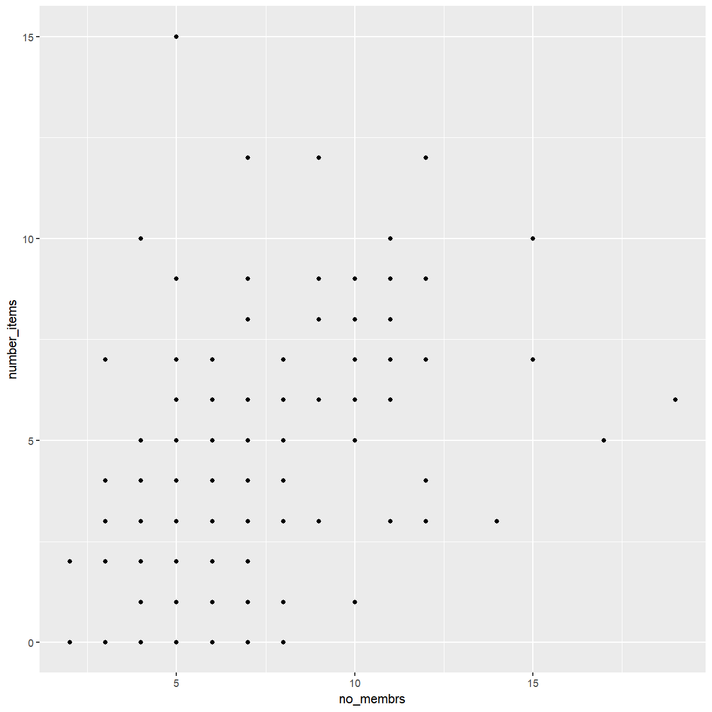

Then, we start modifying this plot to extract more information from it.

> ## Exercise
>
> Because many households share the same values for size and number of items a lot
> of points in our plot end up on top of each other. That makes it hard to see how
> common a given combination is. How could we modify the plot to avoid this problem?
>
> > ## Solution
> > 
> > There are several options, including switching to a different type of plot entirely.
> > For now, let's strick with a scatterplot. We could improve the plot by adding
> > transparency to the points. Another option is to add a small amount of jitter to each
> > point. Together these will avoid most of the overplotting and make it possible to see
> > overlapping points when it does happen.
> {: .solution}
{: .challenge}

We can add transparency using the `alpha` option:


~~~
ggplot(data = interviews_plotting, aes(x = no_membrs, y = number_items)) +
    geom_point(alpha = 0.5)
~~~
{: .language-r}


> ## Note
>
> When setting a mapping to a constant (e.g. `alpha = 0.5` above) these
> can be set directly, without requiring a call to `aes()`.
{: .callout}

That only helped a little bit with the overplotting problem. We can also
introduce a little bit of randomness into the position of our points
using the `geom_jitter()` function.


~~~
ggplot(data = interviews_plotting, aes(x = no_membrs, y = number_items)) +
    geom_jitter(alpha = 0.5)
~~~
{: .language-r}


That is a bit better but now the points with similar *x* and *y* values are a
bit difficult to distinguish. We can fix that by reducing the amount of horizontal
jitter using the `width` argument.


~~~
ggplot(data = interviews_plotting, aes(x = no_membrs, y = number_items)) +
    geom_jitter(alpha = 0.5, width = 0.15, height = 0.15)
~~~
{: .language-r}

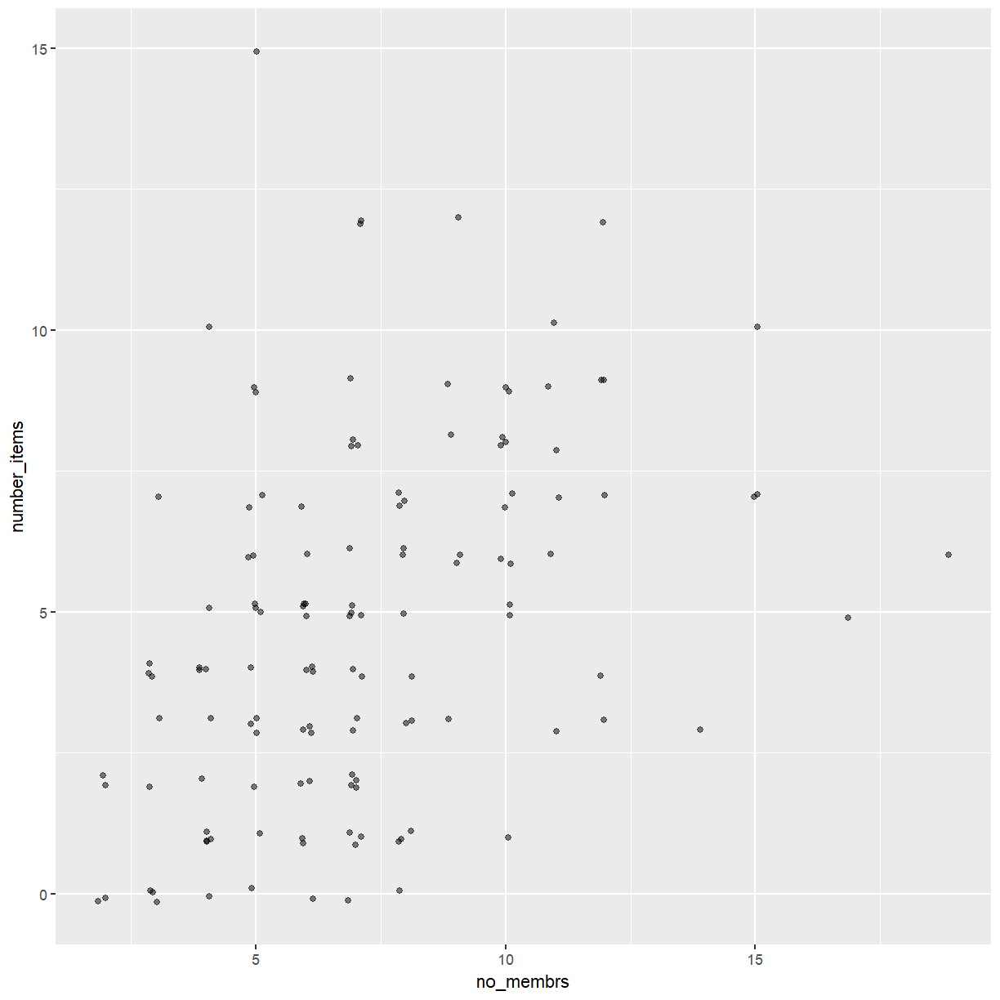

Now the points for each combination of `no_membrs` and `number_items` form small clusters
that can be distinguished visually. 

After creating your plot, you can save it to a file in your favorite format.
The Export tab in the **Plot** pane in RStudio will save your plots at low
resolution, which will not be accepted by many journals and will not scale well for posters.

Instead, use the `ggsave()` function, which allows you easily change the dimension 
and resolution of your plot by adjusting the appropriate arguments (`width`, `height` and `dpi`).
Make sure you have the `fig_output/` folder in your working directory.


~~~
membrs_item_plot <- ggplot(data = interviews_plotting, aes(x = no_membrs, y = number_items)) +
    geom_jitter(alpha = 0.5, width = 0.15, height = 0.15)

ggsave("fig_output/membrs_item.png", membrs_item_plot, width = 15, height = 10)
~~~
{: .language-r}

> ## Note
>
> If you are using *git* to track changes to your script files, you can do the same
> for your plots. Try adding the file you just created to your git repository.
{: .callout}

> ## Exercise
>
> It may be possible to enhance the appearance of the plot further by changing
> the size of the points. Use the `size` argument to change the point size.
> Combine this with the `width` and `height` arguments to adjust the jitter.
>
> Try a few different values. Which one do you like best?
> > ## Solution
> >
> > Here is one possible solution.
> > 
> > 
> > ~~~
> > ggplot(data = interviews_plotting, aes(x = no_membrs, y = number_items)) +
> >     geom_jitter(alpha = 0.5, width = 0.2, height = 0.2, size = 4)
> > ~~~
> > {: .language-r}
> > 
> > 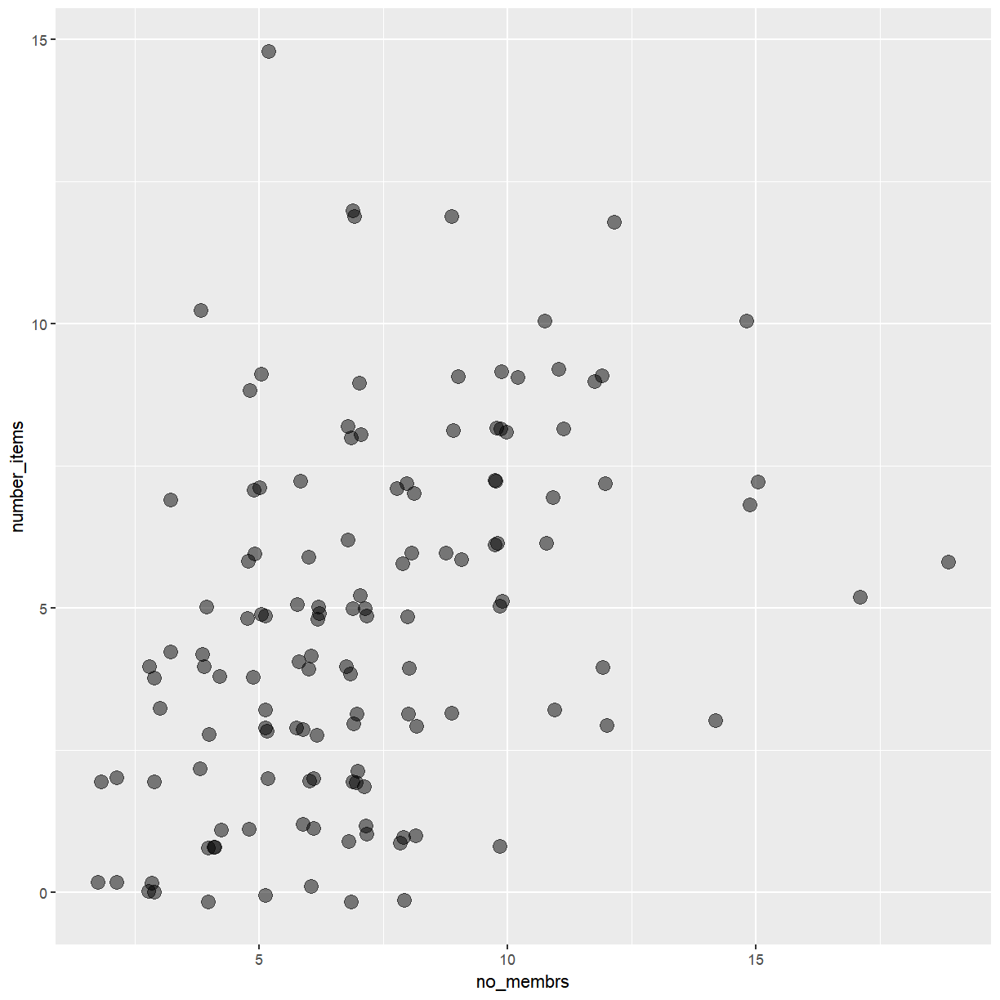
> {: .solution}
{: .challenge}


We can also add colors for all the points:


~~~
ggplot(data = interviews_plotting, aes(x = no_membrs, y = number_items)) +
geom_jitter(alpha = 0.5, width = 0.2, height = 0.2, size = 3, color = "blue")
~~~
{: .language-r}

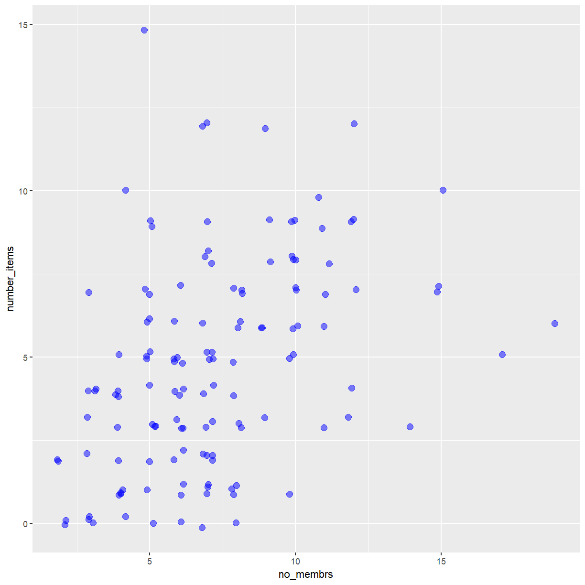

Or to color each village in the plot differently, you could use a vector as an input to the argument **`color`**.
Because we are now mapping features of the data to a color, instead of setting one color for all points,
the color now needs to be set inside a call to the **`aes`** function. **`ggplot2`** will provide a different color
corresponding to different values in the vector. 
Here is an example where we color by **`village`**:


~~~
ggplot(data = interviews_plotting, aes(x = no_membrs, y = number_items)) +
    geom_jitter(aes(color = village), alpha = 0.5, width = 0.2, height = 0.2, size = 3)
~~~
{: .language-r}

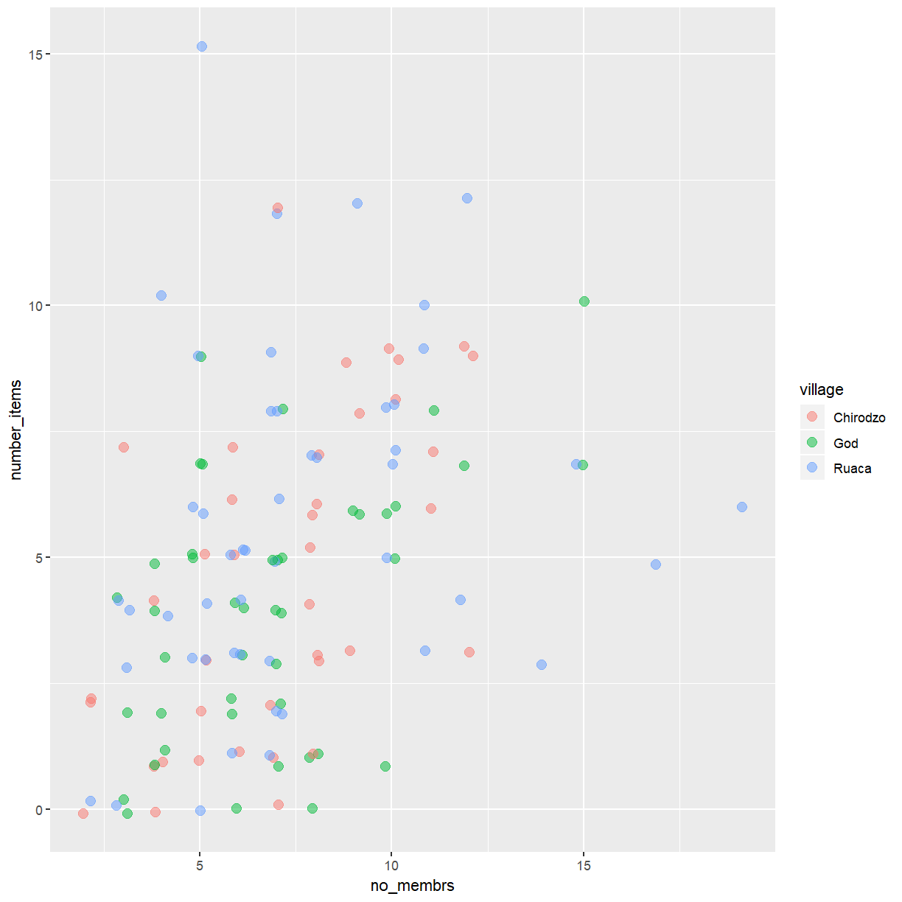

There appears to be a positive trend between number of household
members and number of items owned (from the list provided). This trend
does not appear to be different by village.

You can highlight this aspect of the data by adding a regression line
to the plot. The function `geom_smooth` allows you to add a a variety
of different smoothing functions to the plot. You can choose the type
of smoother to use by setting the `method` argument. Use `method='lm'`
to get a regression line.


~~~
ggplot(data = interviews_plotting, aes(x = no_membrs, y = number_items)) +
    geom_jitter(aes(color = village), alpha = 0.5, width = 0.2, height = 0.2, size = 3) +
    geom_smooth(method='lm')
~~~
{: .language-r}

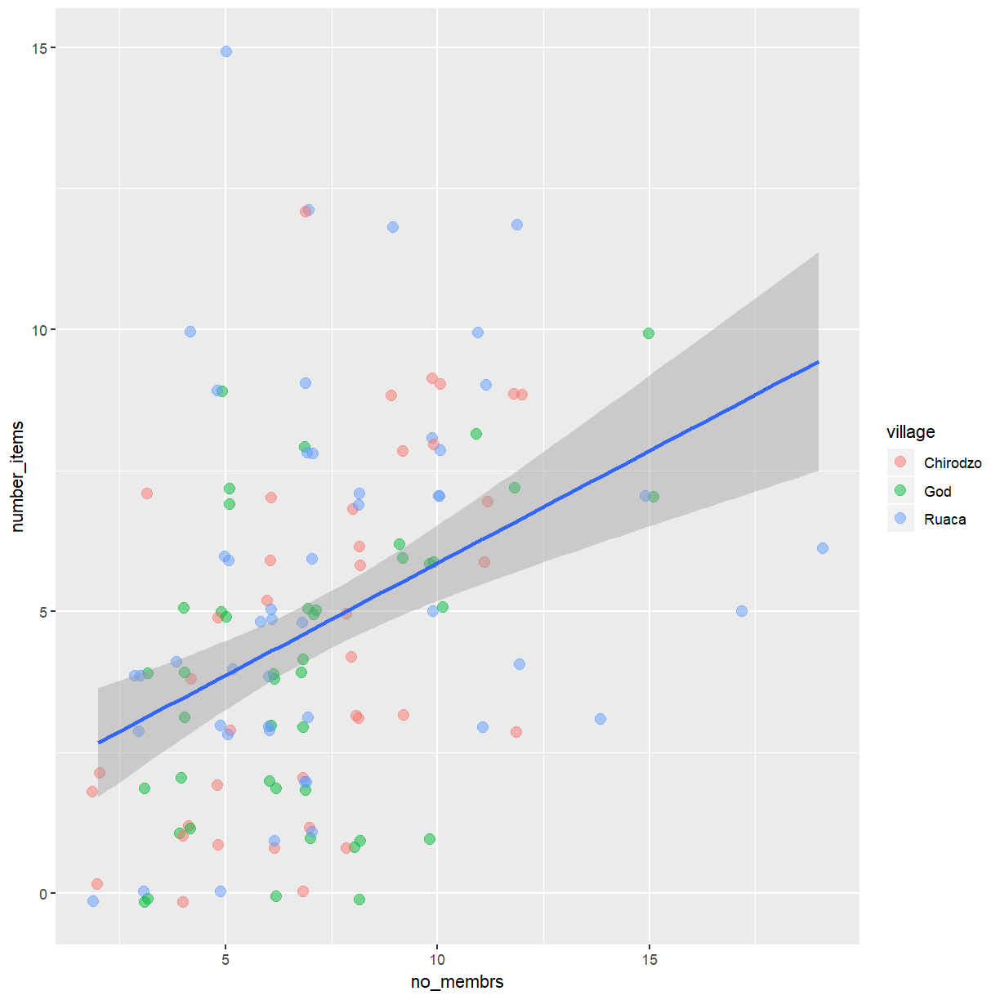

> ## Exercise
>
> Add separate regression lines for each village.
> 
> **Hint:** Asking *ggplot* to map `village` to an aesthetic when drawing the regression
> lines will produce one line per village.
>
> > ## Solution
> >
> > 
> > ~~~
> > ggplot(data = interviews_plotting, aes(x = no_membrs, y = number_items)) +
> >     geom_jitter(aes(color = village), alpha = 0.5, width = 0.2, height = 0.2, size = 3) +
> >     geom_smooth(aes(color = village), method='lm')
> > ~~~
> > {: .language-r}
> > 
> > 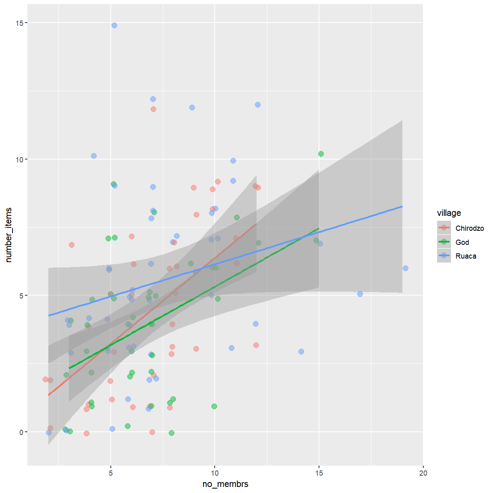
> {: .solution}
{: .challenge}

This will be the last version of this plot you look at today. That seems like
a good time to save the product of your work.


~~~
membrs_item_plot <- ggplot(data = interviews_plotting, aes(x = no_membrs, y = number_items)) +
    geom_jitter(aes(color = village), alpha = 0.5, width = 0.2, height = 0.2, size = 3) +
    geom_smooth(aes(color = village), method='lm')

ggsave("fig_output/membrs_item.png", membrs_item_plot, width = 15, height = 10)
~~~
{: .language-r}


~~~
Warning in grDevices::png(..., res = dpi, units = "in"): unable to open
file 'fig_output/membrs_item.png' for writing
~~~
{: .error}


~~~
Warning in grDevices::png(..., res = dpi, units = "in"): opening device
failed
~~~
{: .error}


~~~
Error in grDevices::png(..., res = dpi, units = "in"): unable to start png() device
~~~
{: .error}


> ## Exercise
>
> Use what you just learned to create a scatter plot of `rooms` by `village`
> with the `respondent_wall_type` showing in different colors. Is this a good
> way to show this type of data?
>
> > ## Solution
> >
> > 
> > ~~~
> > ggplot(data = interviews_plotting, aes(x = village, y = rooms)) +
> >     geom_jitter(aes(color = respondent_wall_type), alpha = 0.5, width = 0.2, height = 0.2, size = 3)
> > ~~~
> > {: .language-r}
> > 
> > 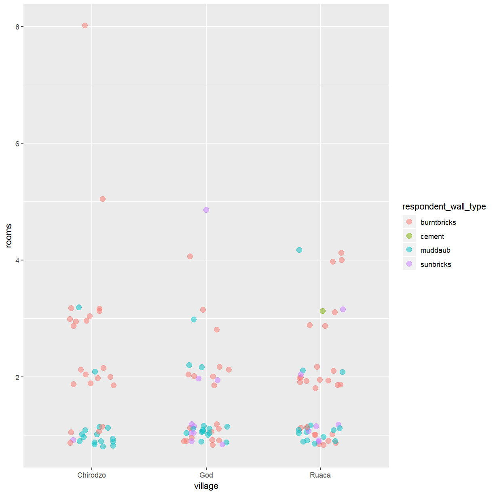
> {: .solution}
{: .challenge}

## Histograms and density plots

While scatterplots are useful when exploring the relationship between two continuous
variables, you may be interested in visualising the distribution of a single variable.
Two plot types commonly used for this purpose are histograms and density plots.

You can create histograms with *ggplot* using `geom_histogram()`. Let's take a look
at the distribution of household size (`no_membrs`).


~~~
ggplot(data = interviews_plotting, aes(x = no_membrs)) +
    geom_histogram()
~~~
{: .language-r}


~~~
`stat_bin()` using `bins = 30`. Pick better value with `binwidth`.
~~~
{: .output}

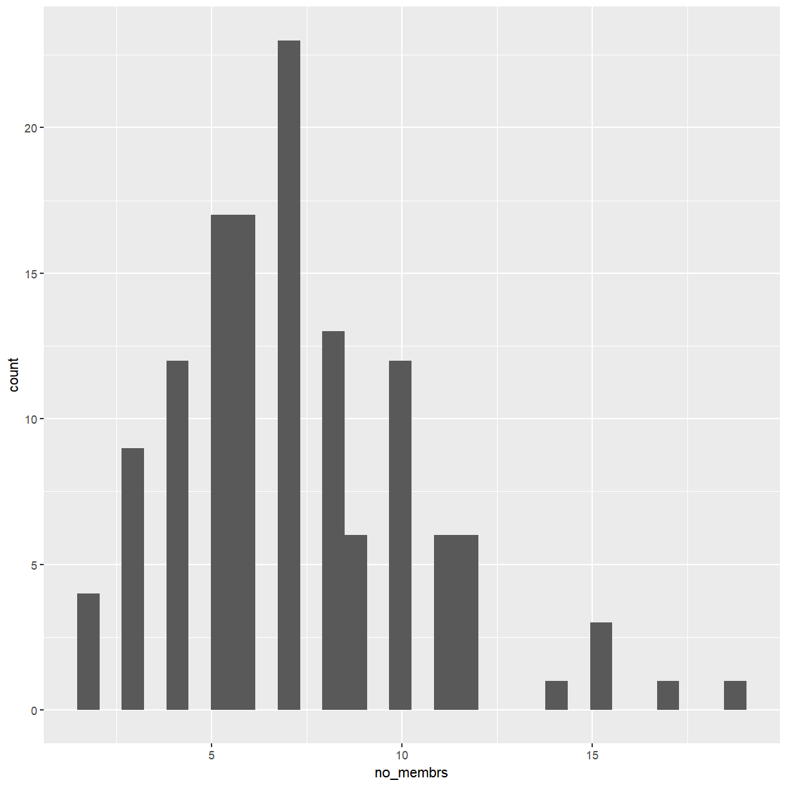

That doesn't look great. Histograms count the number of observations in a series of bins
that cover the range of the data. When creating histograms you have to be mindful of 
the effect the chosen bins have on the appearance of the plot. The most important rule 
to keep in mind is that bins should always be of equal size. But even then the
choice of break points can make a big difference. Since you know that there won't be
any fractional household members it makes sense to set the bin width to 1.


~~~
ggplot(data = interviews_plotting, aes(x = no_membrs)) +
    geom_histogram(binwidth=1)
~~~
{: .language-r}

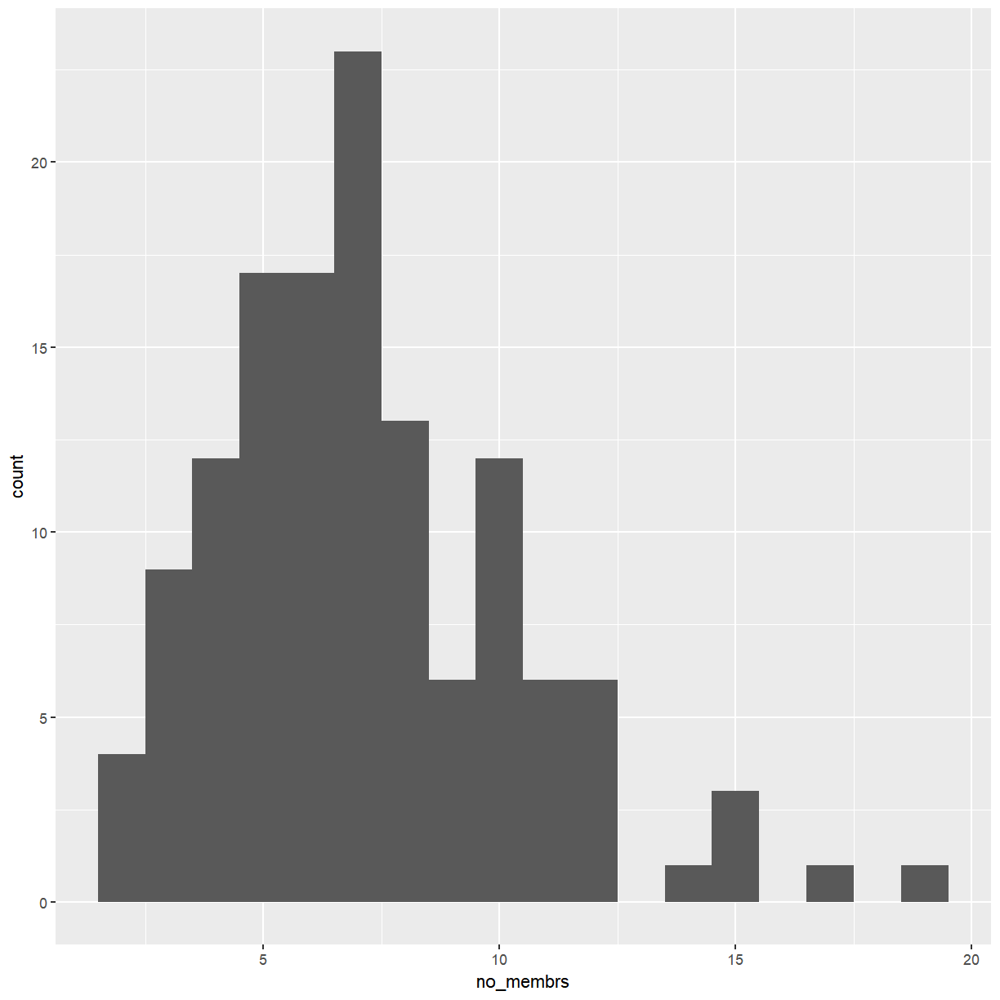

That's a bit better but it is difficult to distinguish adjacent bars of the same hight.
That is easily fixed by setting `color = "white"`.


~~~
ggplot(data = interviews_plotting, aes(x = no_membrs)) +
    geom_histogram(binwidth=1, color="white")
~~~
{: .language-r}

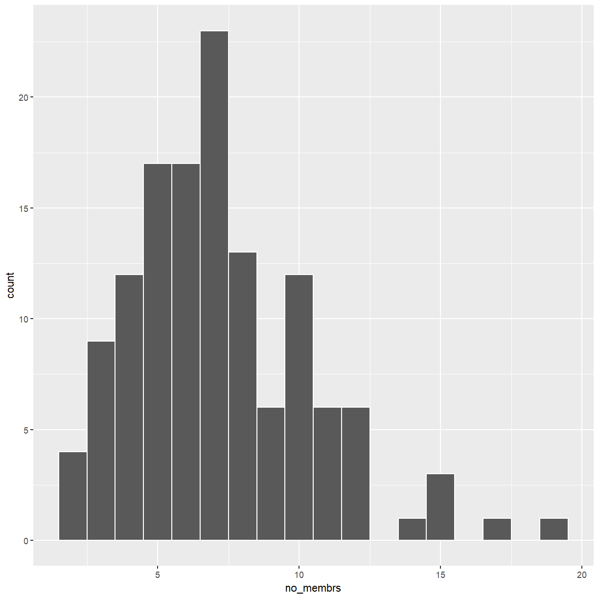

> ## Exercise
> 
> It might be more interesting to look at household size by village. Create a plot
> with separate histograms for each village.
>
> **Hint:** Use `fill` to get different colored bars.
>
> > ## Solution
> >
> > 
> > ~~~
> > ggplot(data = interviews_plotting, aes(x = no_membrs, fill = village)) +
> >     geom_histogram(binwidth=1, color="white")
> > ~~~
> > {: .language-r}
> > 
> > 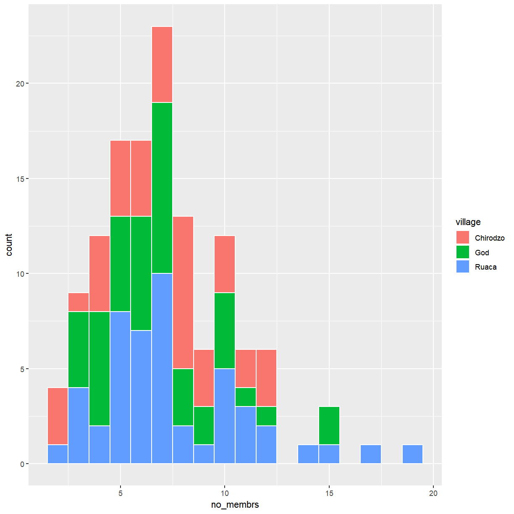
> {: .solution}
>
> Is this a good plot? How could it be improved?
{: .challenge}

Stacked histograms tend to be hard to read. One alternative
is the use of frequency polygons. To switch from histograms to frequency polygons
simply replace `geom_histogram()` with `geom_freqpoly()`


~~~
ggplot(data = interviews_plotting, aes(x = no_membrs, color = village)) +
    geom_freqpoly(binwidth=1)
~~~
{: .language-r}

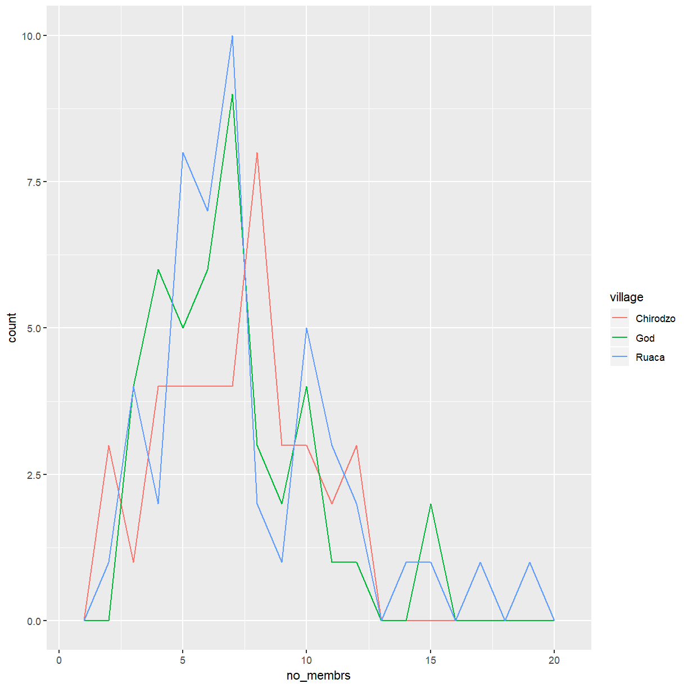

Since the number of responses may differ between villages it can be problematic
to compare absolute counts like this. Instead, it is better to look at densities.
You can create the same plot as above for densities by using `stat(density)`.


~~~
ggplot(data = interviews_plotting, aes(x = no_membrs, y = stat(density), color = village)) +
    geom_freqpoly(binwidth=1)
~~~
{: .language-r}

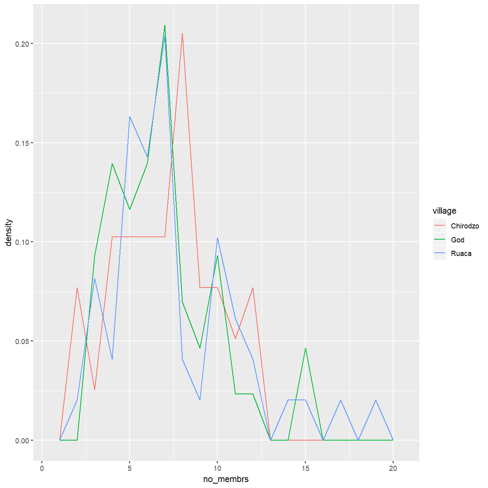

You can achieve a similar effect with density plots, using `geom_density()`.


~~~
ggplot(data = interviews_plotting, aes(x = no_membrs, color = village)) +
    geom_density()
~~~
{: .language-r}

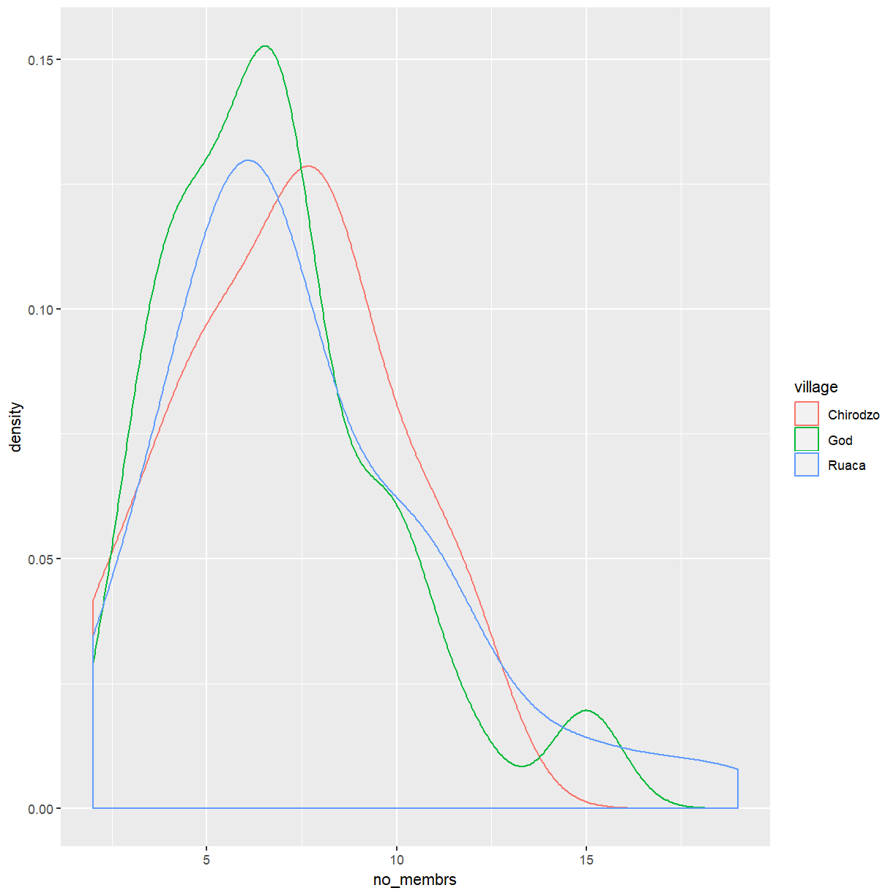

This provides a smoothed density estimate that is generally more appropriate
for data that are less discrete.


