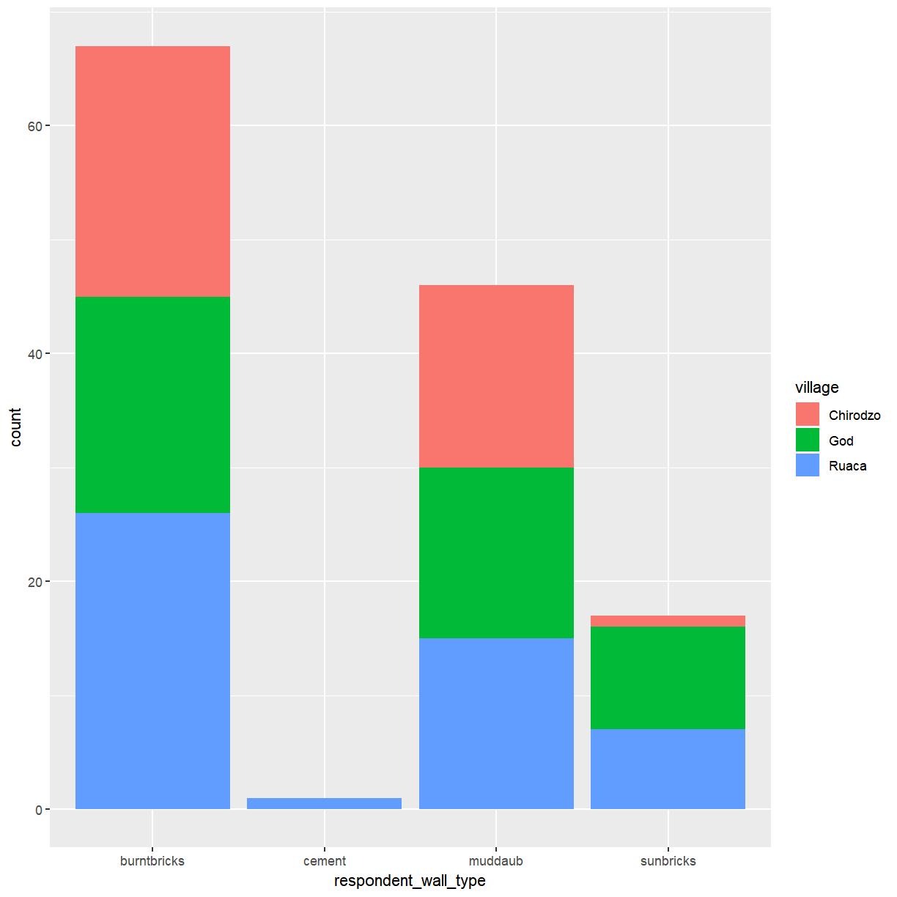
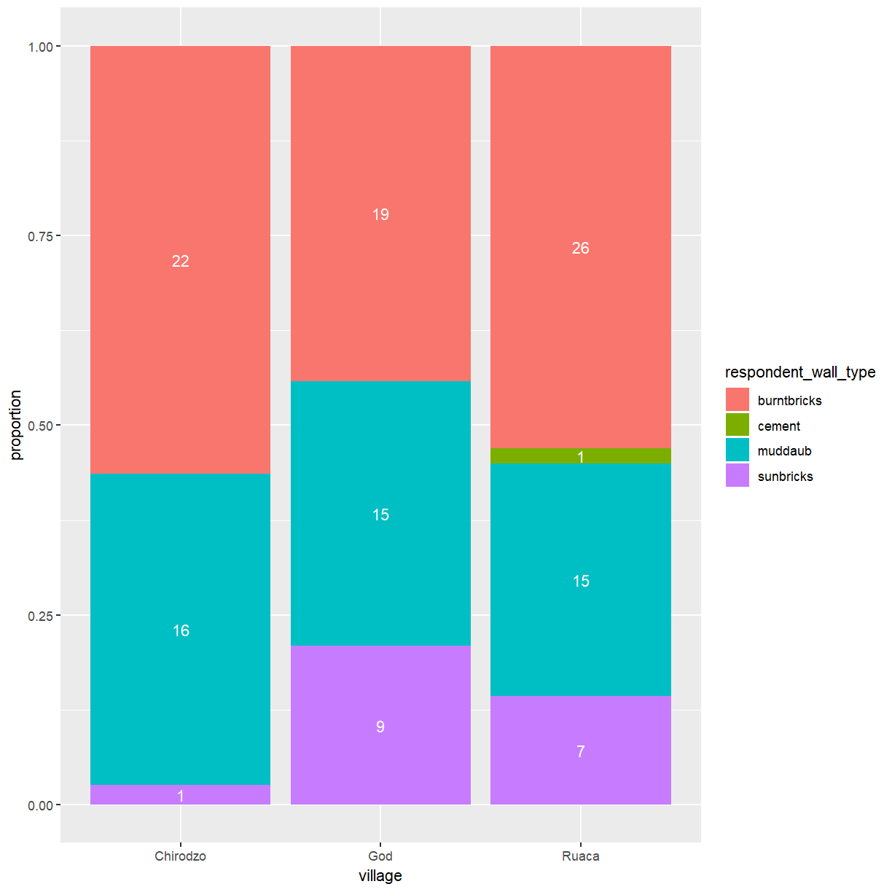
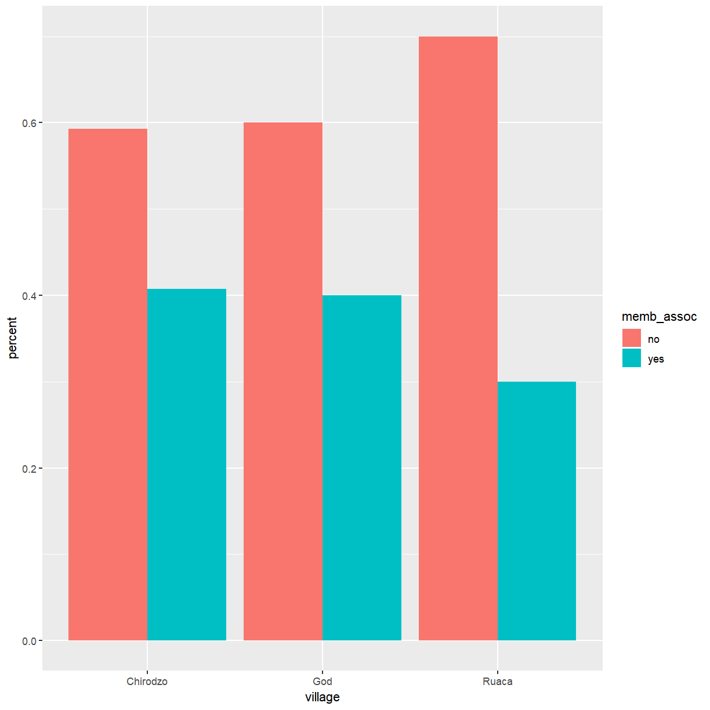
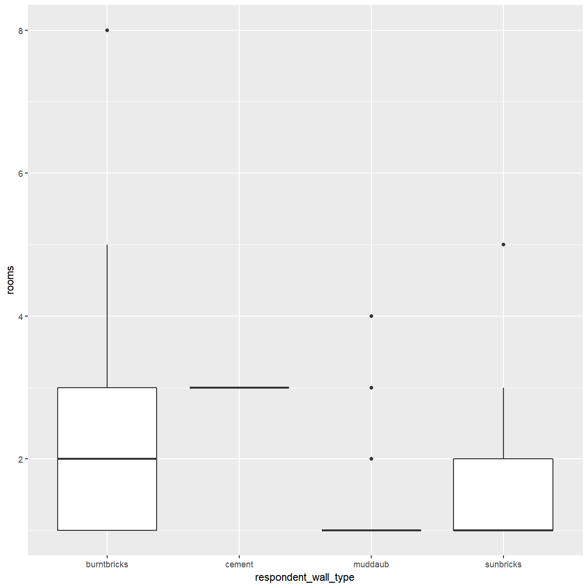
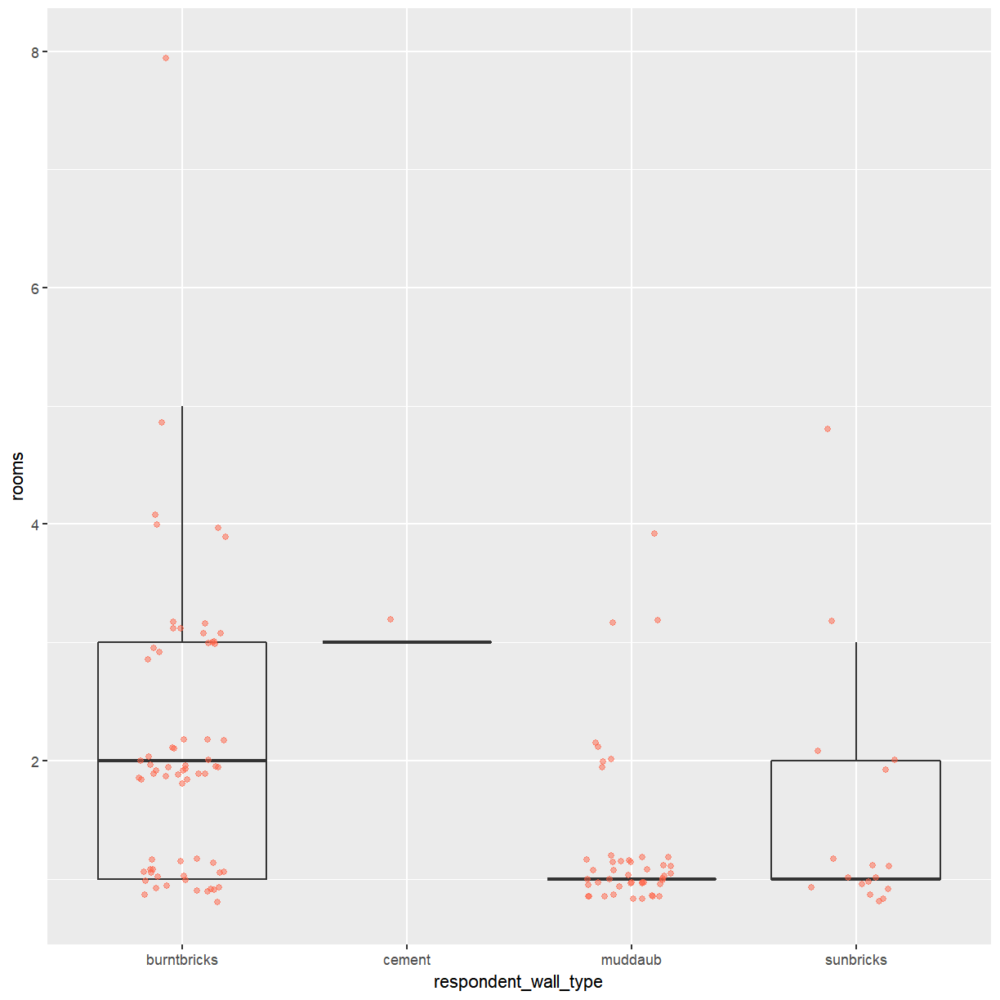
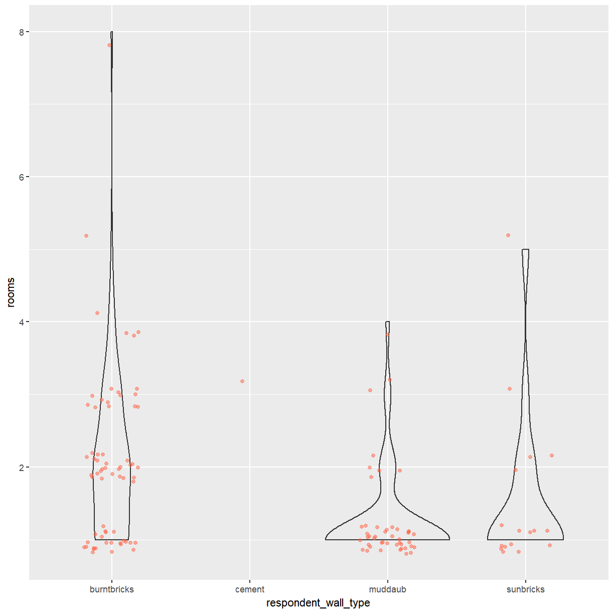
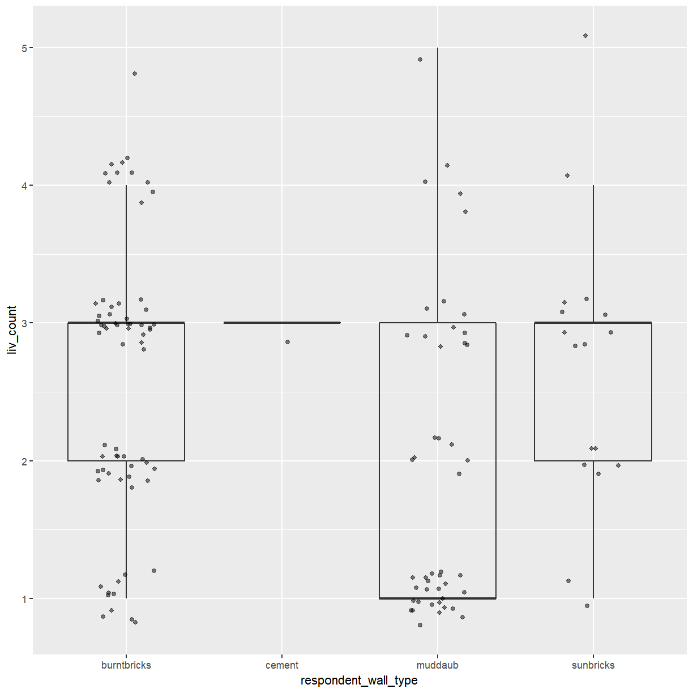
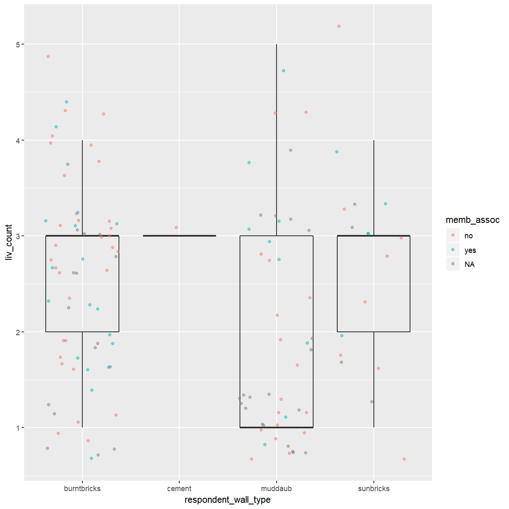

---
# Please do not edit this file directly; it is auto generated.
# Instead, please edit 02-categorical-data.md in _episodes_rmd/
title: "Plotting categorical data with ggplot2"
teaching: 120
exercises: 60
questions:
  - "How do I create bar charts and box plots?"
  - "What are potential pitfalls when using bar charts and box plots?"
objectives:
   - "Produce bar charts and box plots using ggplot."
keypoints:
   - "Bar charts are useful for visualising the frequency of categorical variables."
   - "Box plots show the distribution of a continuous variable across different groups."
   - "Individual data points should be included in a plot whenever possible."
---

We start by loading the required package. **`ggplot2`** is also included in the
**`tidyverse`** package.

~~~
library(tidyverse)
~~~
{: .language-r}

If you don't have the data loaded in your current R session you'll have
to import into R before you can proceed.

~~~
interviews_plotting <- read_csv("data_output/interviews_plotting.csv")
~~~
{: .language-r}

~~~
Parsed with column specification:
cols(
  .default = col_logical(),
  key_ID = col_integer(),
  village = col_character(),
  interview_date = col_datetime(format = ""),
  no_membrs = col_integer(),
  years_liv = col_integer(),
  respondent_wall_type = col_character(),
  rooms = col_integer(),
  memb_assoc = col_character(),
  affect_conflicts = col_character(),
  liv_count = col_integer(),
  items_owned = col_character(),
  no_meals = col_integer(),
  months_lack_food = col_character(),
  instanceID = col_character(),
  number_month_lack_food = col_integer(),
  number_items = col_integer()
)
~~~
{: .output}

~~~
See spec(...) for full column specifications.
~~~
{: .output}

## Barplots

Barplots are useful for visualizing categorical data. By default,
`geom_bar` accepts a variable for x, and plots the number of instances each
value of x (in this case, wall type) appears in the dataset.

~~~
ggplot(data = interviews_plotting, aes(x = respondent_wall_type)) +
    geom_bar()
~~~
{: .language-r}

We can use the `fill` aesthetic for the `geom_bar()` geom to color bars by
the portion of each count that is from each village.

~~~
ggplot(data = interviews_plotting, aes(x = respondent_wall_type)) +
    geom_bar(aes(fill = village))
~~~
{: .language-r}

This creates a stacked bar chart. These are generally more difficult to read
than side-by-side bars. We can separate the portions of the stacked bar that
correspond to each village and put them side-by-side by using the `position`
argument for `geom_bar()` and setting it to "dodge".

~~~
ggplot(data = interviews_plotting, aes(x = respondent_wall_type)) +
    geom_bar(aes(fill = village), position = "dodge")
~~~
{: .language-r}

This is a nicer graphic, but we're more likely to be interested in the
proportion of each housing type in each village than in the actual count of
number of houses of each type (because we might have sampled different numbers
of households in each village). To compare proportions, we will first create a
new data frame (`percent_wall_type`) with a new column named "percent"
representing the percent of each house type in each village. We will remove
houses with cement walls, as there was only one in the dataset.

~~~
percent_wall_type <- interviews_plotting %>%
    filter(respondent_wall_type != "cement") %>%
    count(village, respondent_wall_type) %>%
    group_by(village) %>%
    mutate(percent = n / sum(n)) %>%
    ungroup()
~~~
{: .language-r}

Now we can use this new data frame to create our plot showing the
percentage of each house type in each village.

~~~
 ggplot(percent_wall_type, aes(x = village, y = percent, fill = respondent_wall_type)) +
     geom_bar(stat = "identity", position = "dodge")
~~~
{: .language-r}

> ## Exercise
>
> Create a bar plot showing the proportion of respondents in each
> village who are or are not part of an irrigation association
> (`memb_assoc`). Include only respondents who answered that question
> in the calculations and plot. Which village had the lowest proportion of
> respondents in an irrigation association?
>
> > ## Solution
> >
> > 
> > ~~~
> > percent_memb_assoc <- interviews_plotting %>%
> >   filter(!is.na(memb_assoc)) %>%
> >   count(village, memb_assoc) %>%
> >   group_by(village) %>%
> >   mutate(percent = n / sum(n)) %>%
> >   ungroup()
> > 
> > ggplot(percent_memb_assoc, aes(x = village, y = percent, fill = memb_assoc)) +
> > geom_bar(stat = "identity", position = "dodge")
> > ~~~
> > {: .language-r}
> > 
> > 
> >
> > Ruaca had the lowest proportion of members in an irrigation association.
> {: .solution}
{: .challenge}

## Boxplot

We can use boxplots to visualize the distribution of rooms for each
wall type:

~~~
ggplot(data = interviews_plotting, aes(x = respondent_wall_type, y = rooms)) +
    geom_boxplot()
~~~
{: .language-r}

By adding points to a boxplot, we can have a better idea of the number of
measurements and of their distribution:

~~~
ggplot(data = interviews_plotting, aes(x = respondent_wall_type, y = rooms)) +
    geom_boxplot(alpha = 0) +
    geom_jitter(alpha = 0.5, color = "tomato")
~~~
{: .language-r}

We can see that muddaub houses and sunbrick houses tend to be smaller than
burntbrick houses.

Notice how the boxplot layer is behind the jitter layer? What do you need to
change in the code to put the boxplot in front of the points such that it's not
hidden?

> ## Exercise
>
> Boxplots are useful summaries, but hide the *shape* of the distribution. For
> example, if the distribution is bimodal, we would not see it in a
> boxplot. An alternative to the boxplot is the violin plot, where the shape
> (of the density of points) is drawn.
>
> - Replace the box plot with a violin plot; see `geom_violin()`.
> 
> > ## Solution
> >
> > 
> > ~~~
> > ggplot(data = interviews_plotting, aes(x = respondent_wall_type, y = rooms)) +
> >   geom_violin(alpha = 0) +
> >   geom_jitter(alpha = 0.5, color = "tomato")
> > ~~~
> > {: .language-r}
> > 
> > 
> {: .solution}
>
> So far, we've looked at the distribution of room number within wall type. Try
> making a new plot to explore the distribution of another variable within wall
> type.
>
> - Create a boxplot for `liv_count` for each wall type. Overlay the boxplot
>   layer on a jitter layer to show actual measurements.
>
> > ## Solution
> > 
> > ~~~
> > ggplot(data = interviews_plotting, aes(x = respondent_wall_type, y = liv_count)) +
> >   geom_boxplot(alpha = 0) +
> >   geom_jitter(alpha = 0.5)
> > ~~~
> > {: .language-r}
> > 
> > 
> {: .solution}
>
> - Add color to the data points on your boxplot according to whether the
>   respondent is a member of an irrigation association (`memb_assoc`).
>
> > ## Solution
> > 
> > ~~~
> > ggplot(data = interviews_plotting, aes(x = respondent_wall_type, y = liv_count)) +
> >   geom_boxplot(alpha = 0) +
> >   geom_jitter(aes(color = memb_assoc), alpha = 0.5)
> > ~~~
> > {: .language-r}
> > 
> > 
> {: .solution}
{: .challenge}


