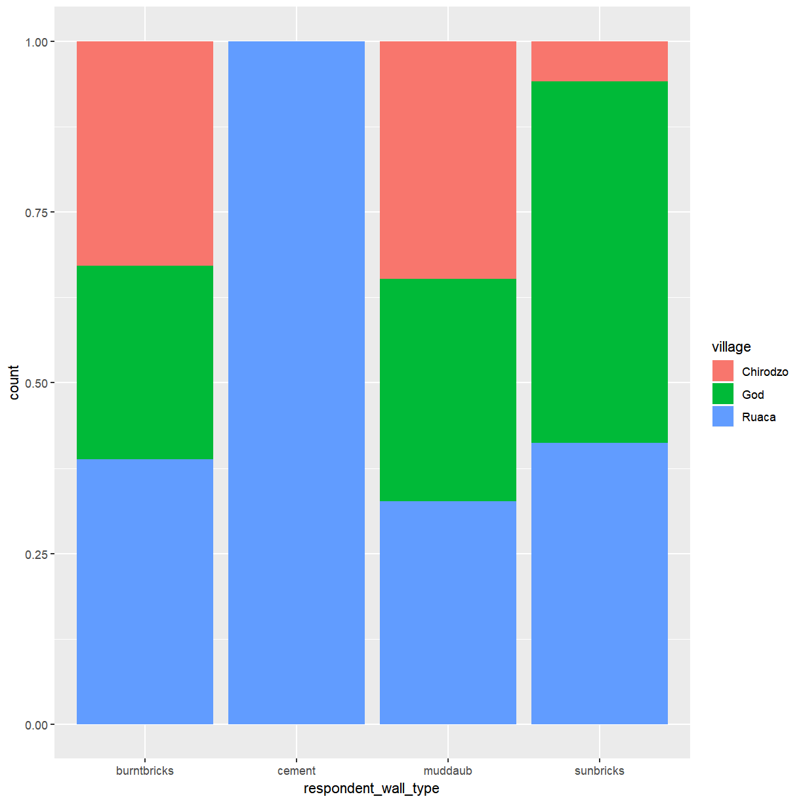
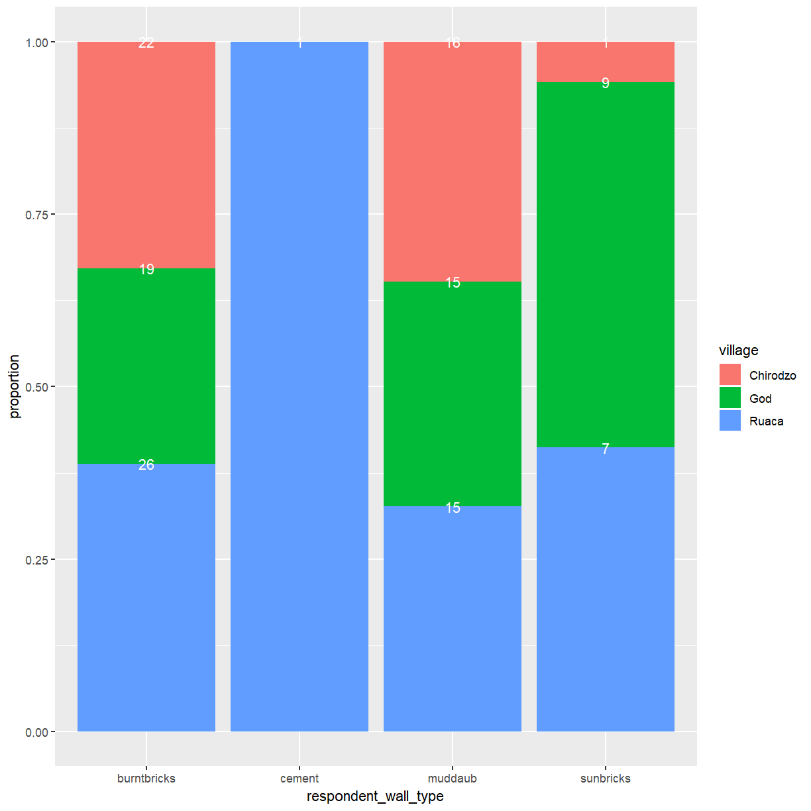
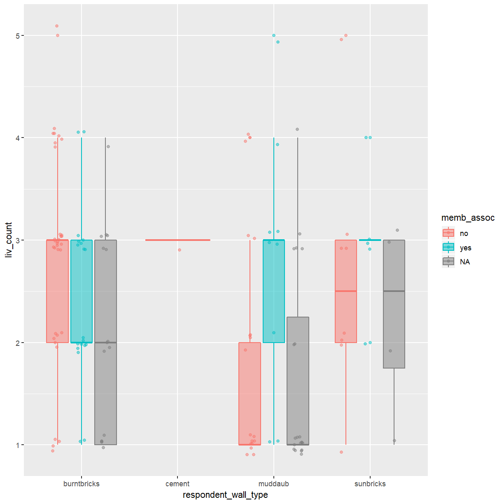

---
# Please do not edit this file directly; it is auto generated.
# Instead, please edit 02-categorical-data.md in _episodes_rmd/
title: "Plotting categorical data with ggplot2"
teaching: 60
exercises: 30
questions:
  - "How do I create bar charts and box plots?"
  - "What are potential pitfalls when using bar charts and box plots?"
objectives:
   - "Produce bar charts and box plots using ggplot."
keypoints:
   - "Bar charts are useful for visualising the frequency of categorical variables."
   - "Box plots show the distribution of a continuous variable across different groups."
   - "Individual data points should be included in a plot whenever possible."
---

We start by loading the required package. **`ggplot2`** is also included in the
**`tidyverse`** package.

~~~
library(tidyverse)
~~~
{: .language-r}

If you don't have the data loaded in your current R session you'll have
to import into R before you can proceed.

~~~
interviews_plotting <- read_csv("data_output/interviews_plotting.csv")
~~~
{: .language-r}

~~~
Parsed with column specification:
cols(
  .default = col_logical(),
  key_ID = col_integer(),
  village = col_character(),
  interview_date = col_datetime(format = ""),
  no_membrs = col_integer(),
  years_liv = col_integer(),
  respondent_wall_type = col_character(),
  rooms = col_integer(),
  memb_assoc = col_character(),
  affect_conflicts = col_character(),
  liv_count = col_integer(),
  items_owned = col_character(),
  no_meals = col_integer(),
  months_lack_food = col_character(),
  instanceID = col_character(),
  number_month_lack_food = col_integer(),
  number_items = col_integer()
)
~~~
{: .output}

~~~
See spec(...) for full column specifications.
~~~
{: .output}

## Barplots

Barplots are useful for visualizing categorical data. By default,
`geom_bar` accepts a variable for x, and plots the number of times each
value of x (in this case, wall type) appears in the dataset.

~~~
ggplot(data = interviews_plotting, aes(x = respondent_wall_type)) +
    geom_bar()
~~~
{: .language-r}

You can use the `fill` aesthetic for the `geom_bar()` geom to color bars by
the portion of each count that is from each village.

~~~
ggplot(data = interviews_plotting, aes(x = respondent_wall_type, fill = village)) +
    geom_bar()
~~~
{: .language-r}

This creates a stacked bar chart. These are generally more difficult to read
than side-by-side bars. We can separate the portions of the stacked bar that
correspond to each village and put them side-by-side by using the `position`
argument for `geom_bar()` and setting it to "dodge".

~~~
ggplot(data = interviews_plotting, aes(x = respondent_wall_type, fill = village)) +
    geom_bar(position = "dodge")
~~~
{: .language-r}

This is a nicer graphic, but what if you're more interested in the
proportion of each housing type in each village than in the actual count of
number of houses of each type. If you don't mind using stacked bars *ggplot*
provides an easy solution using `position = "fill"`.

~~~
ggplot(data = interviews_plotting, aes(x = respondent_wall_type, fill = village)) +
    geom_bar(position = "fill")
~~~
{: .language-r}

This creates stacked bars for each wall type with the hight of the different
colored sub-bars corresponding to the proportion of this wall type contributed
by the three villages. Note that this changes the scale of the *y* axis,
which is now showing proportions rather than counts. There is no corresponding
update to the axis label, which may be confusing. You can use the `ylab()` 
function to change that.

~~~
ggplot(data = interviews_plotting, aes(x = respondent_wall_type, fill = village)) +
    geom_bar(position = "fill") + ylab("proportion")
~~~
{: .language-r}

One problem with this plot is that there is no indication how many observations
contributed to each of the bars. A possible way around this issue is to add
the corresponding counts to the plot. This requires you to specify the counts for each group.
These are computed by *ggplot* when creating the plot, but how can you access them
for use in another layer? You can access this information in two different ways.
The first relies on the use of the `stat_*` functions provided by *ggplot*. This family
of functions provides some commonly used computed aesthetics, like the bar hight
for a bar plot. The relevant fuction for this example is `stat_count()`. To 
enable `stat_count()` to add content to your plot you need to tell it how the data
should be represented via the `geom` argument. To get labels you need `geom = "text"`.
The second method is needed when using a computed aesthetic as an argument to `aes()`.
For this purpose *ggplot* provides the `stat()` function, which takes the name of
the required statistic (`count` in this case) as its argument. You also need
to account for the fact that bars are now scaled to fill the height of the
plotting area by telling `stat_count()` to use `position = "fill"`.

~~~
ggplot(data = interviews_plotting, aes(x = respondent_wall_type, fill = village)) +
    geom_bar(position = "fill") + ylab("proportion") +
    stat_count(geom = "text", 
             aes(label = stat(count)),
             position="fill", colour="white")
~~~
{: .language-r}

This mostly works but the placement of labels at the top end of the bars isn't
ideal. The `vjust` argument allows you to control the vertical positioning of
text labels. Setting this to 0.5 will center the label in the available space. 

~~~
ggplot(data = interviews_plotting, aes(x = respondent_wall_type, fill = village)) +
    geom_bar(position = "fill") + ylab("proportion") +
    stat_count(geom = "text", 
             aes(label = stat(count)),
             position=position_fill(vjust=0.5), colour="white")
~~~
{: .language-r}

> ## Exercise
>
> So far you've looked at how the different wall types are distributed across the
> villages. A more interesting question might be what the makup of wall types
> within each of the villages is and how they compare to each other.
>
> Create a plot that shows the proportion of wall types by village. What
> differences do you notice?
> 
> > ## Solution
> >
> > 
> > ~~~
> > ggplot(data = interviews_plotting, aes(fill = respondent_wall_type, x = village)) +
> >     geom_bar(position = "fill") + ylab("proportion") +
> >     stat_count(geom = "text", 
> >              aes(label = stat(count)),
> >              position=position_fill(vjust=0.5), colour="white")
> > ~~~
> > {: .language-r}
> > 
> > 
> {: .solution}
{: .challenge}

## Boxplot

In an aerlier lesson you've used density plots to examine the differences in the distribution of 
a continuous variable across different levels of a categorical variable. That can work fine for
two or three categories but quickly becomes hard to read. Boxplots are much better suited to visualize
of a variable across several categories. Let's look at a boxplot of the distribution of rooms for each
wall type:

~~~
ggplot(data = interviews_plotting, aes(x = respondent_wall_type, y = rooms)) +
    geom_boxplot()
~~~
{: .language-r}

This is not bad, but because boxplots focus on displaying summary statistics a lot of 
information is lost. 

> ## Exercise
> 
> Consider the *cement* buildings in the boxplot above. Judging from
> this plot alone, can you tell how many buildings with cement walls there
> are in the dataset?
>
> > ## Solution
> >
> > From the plot it appears that all buildings with cement walls have three rooms
> > but there is no way to tell whether there is 1 or 20 of them.
> {: .solution}
{: .challenge}

By adding points to a boxplot, we can have a better idea of the number of
measurements and of their distribution:

~~~
ggplot(data = interviews_plotting, aes(x = respondent_wall_type, y = rooms)) +
    geom_boxplot(alpha = 0) +
    geom_jitter(alpha = 0.5, width = 0.2, height = 0.2, color = "tomato")
~~~
{: .language-r}

We can see that muddaub houses and sunbrick houses tend to be smaller than
burntbrick houses.

Notice how the boxplot layer is behind the jitter layer? What do you need to
change in the code to put the boxplot in front of the points such that it's not
hidden?

> ## Exercise
>
> So far, we've looked at the distribution of room number within wall type. Try
> making a new plot to explore the distribution of another variable within wall
> type.
>
> - Create a boxplot for `liv_count` for each wall type. Overlay the boxplot
>   layer on a jitter layer to show actual measurements.
>
> > ## Solution
> > 
> > ~~~
> > ggplot(data = interviews_plotting, aes(x = respondent_wall_type, y = liv_count)) +
> >   geom_boxplot(alpha = 0) +
> >   geom_jitter(alpha = 0.5, width = 0.2, height = 0.2)
> > ~~~
> > {: .language-r}
> > 
> > 
> {: .solution}
>
> - Add color to the data points on your boxplot according to whether the
>   respondent is a member of an irrigation association (`memb_assoc`).
>
> > ## Solution
> > 
> > ~~~
> > ggplot(data = interviews_plotting, aes(x = respondent_wall_type, y = liv_count, color = memb_assoc)) +
> >   geom_boxplot(alpha = 0) +
> >   geom_jitter(, alpha = 0.5, width = 0.2, height = 0.2)
> > ~~~
> > {: .language-r}
> > 
> > 
> {: .solution}
{: .challenge}

In the boxplot you created during the exercise above you used different colored points
to highlight groupings according to a second categorical variable. A better way to
compare these categories is to add more boxes to the plot.

~~~
ggplot(data = interviews_plotting, aes(x = respondent_wall_type, y = liv_count, fill = memb_assoc, color = memb_assoc)) +
  geom_boxplot(alpha = 0.5) +
  geom_point(alpha = 0.5, position = position_jitterdodge(jitter.width = 0.1, jitter.height = 0.1))
~~~
{: .language-r}

> ## Exercise
>
> Boxplots are useful summaries, but hide the *shape* of the distribution. For
> example, if the distribution is bimodal, we would not see it in a
> boxplot. An alternative to the boxplot is the violin plot, where the shape
> (of the density of points) is drawn.
>
> - Replace the box plot of rooms by wall type with a violin plot; see `geom_violin()`.
> 
> > ## Solution
> >
> > 
> > ~~~
> > ggplot(data = interviews_plotting, aes(x = respondent_wall_type, y = rooms)) +
> >     geom_violin(alpha = 0) +
> >     geom_jitter(alpha = 0.5, width = 0.2, height = 0.2, color = "tomato")
> > ~~~
> > {: .language-r}
> > 
> > 
> {: .solution}
{: .challenge}


