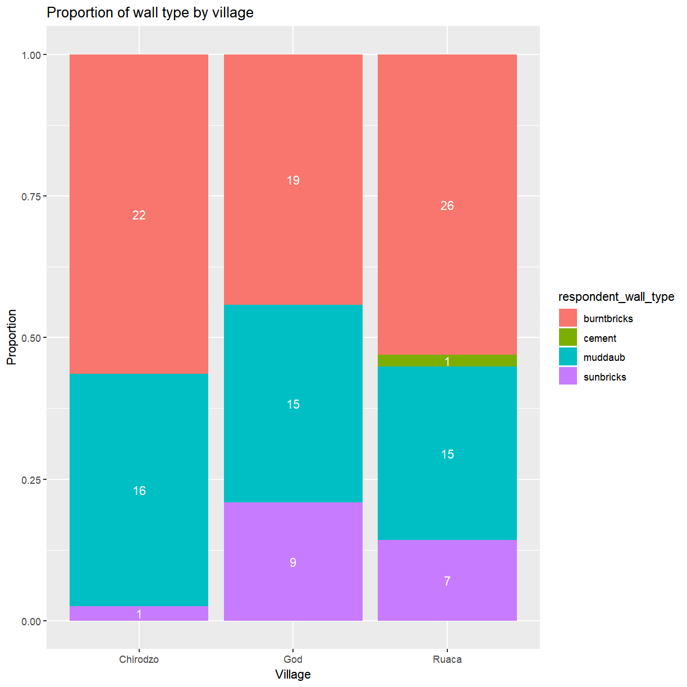
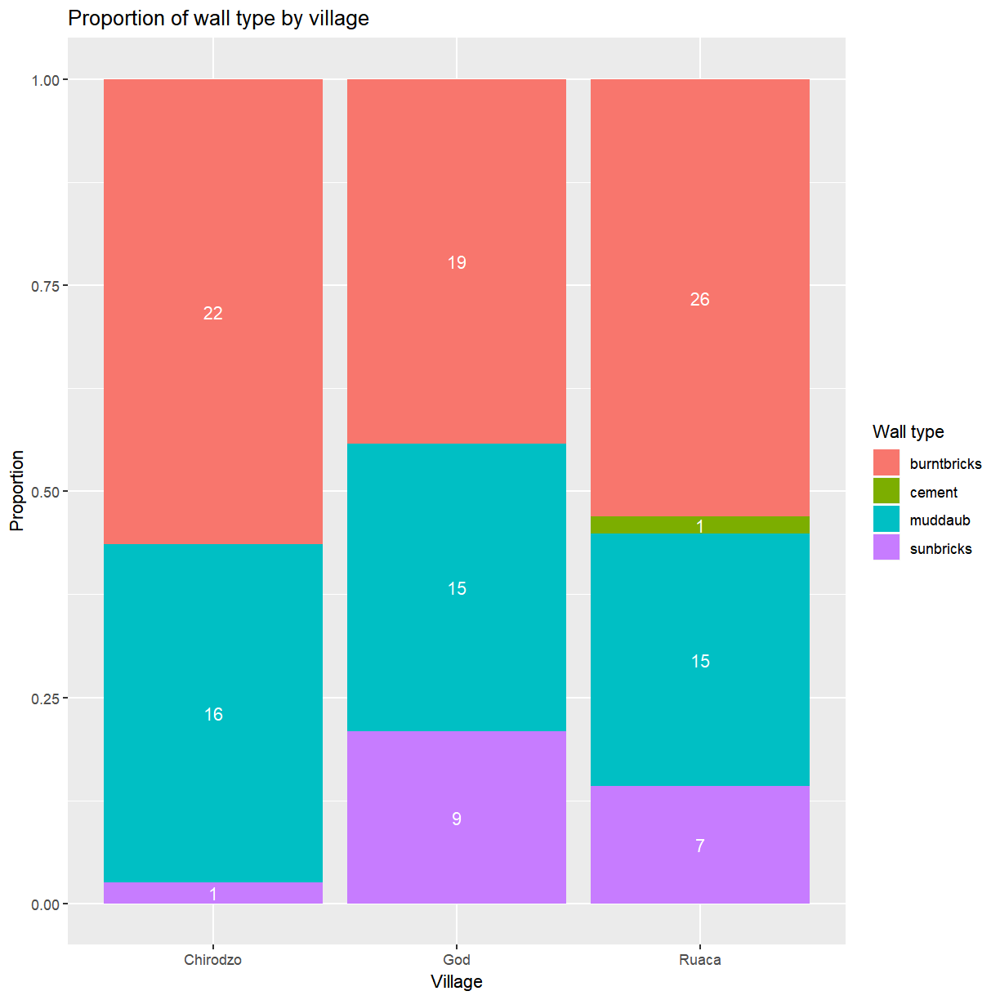
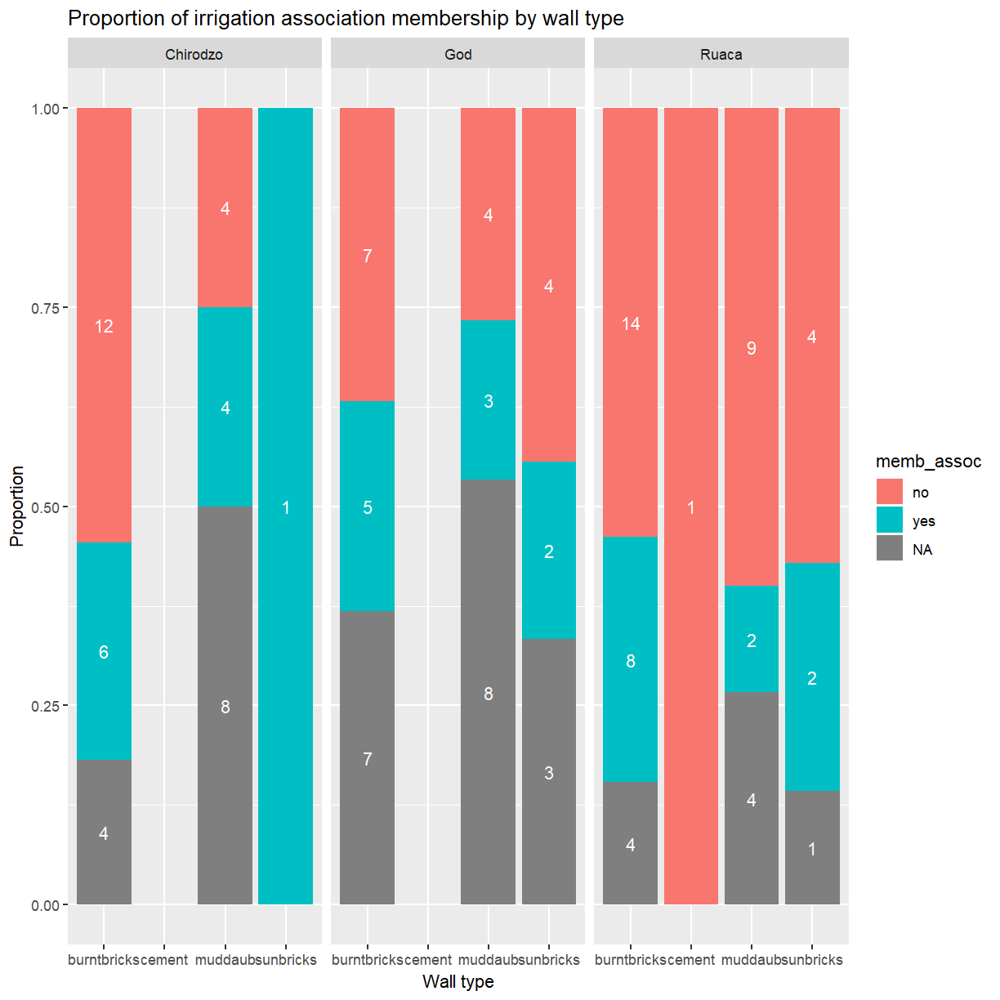
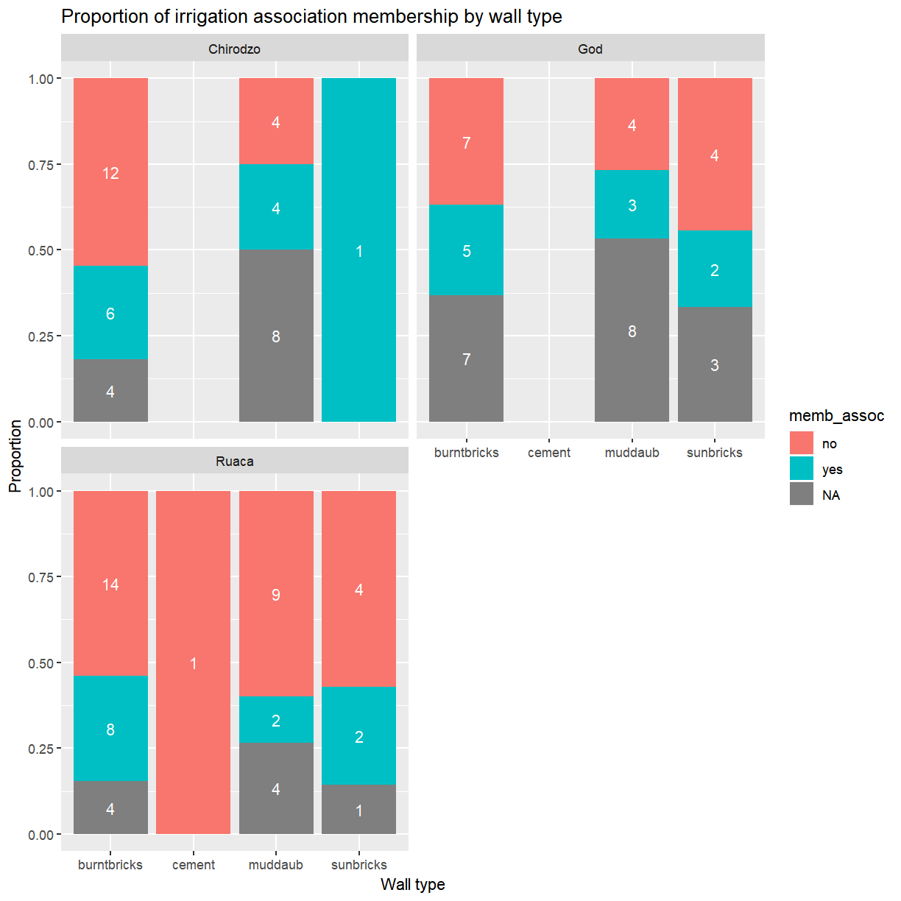
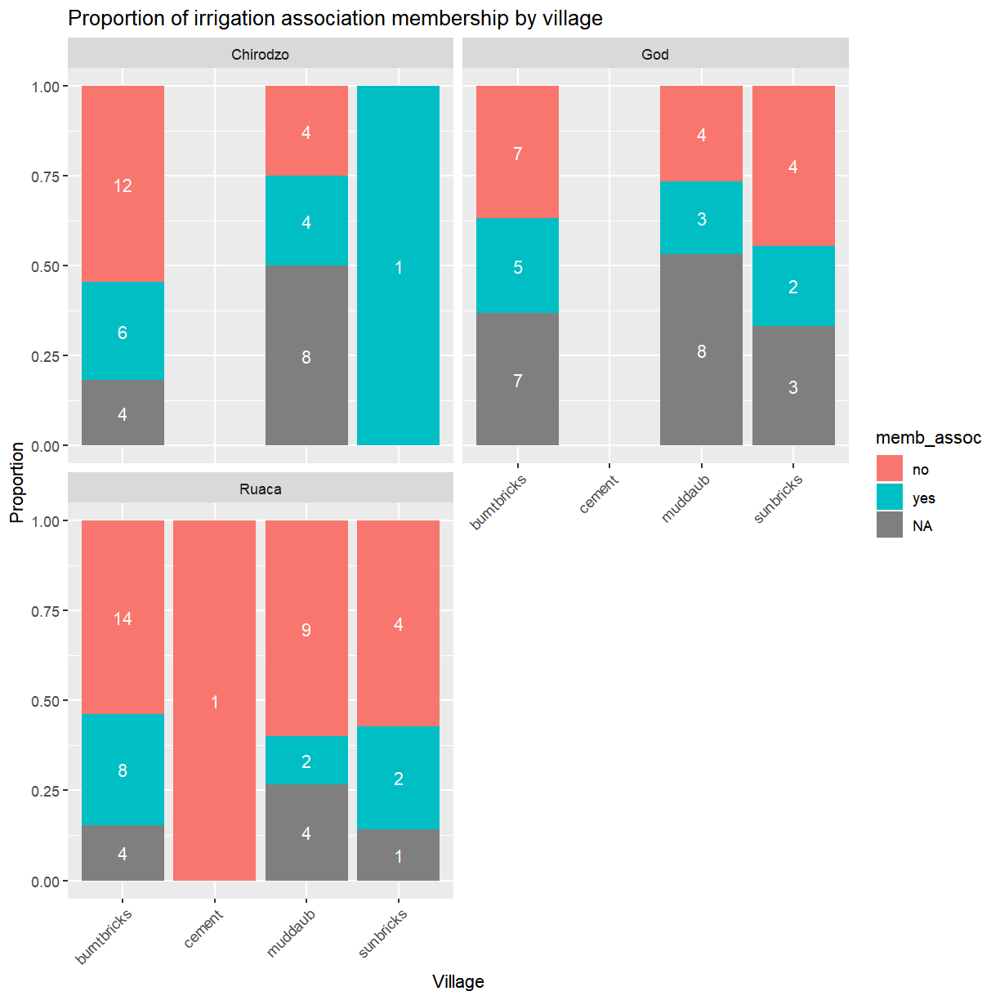
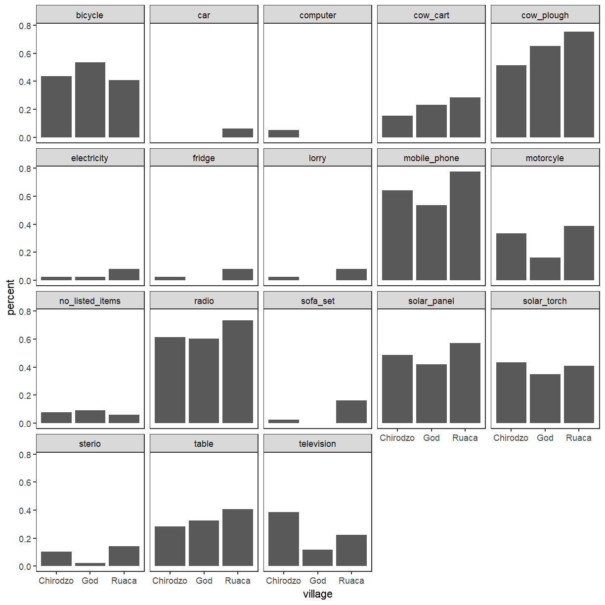
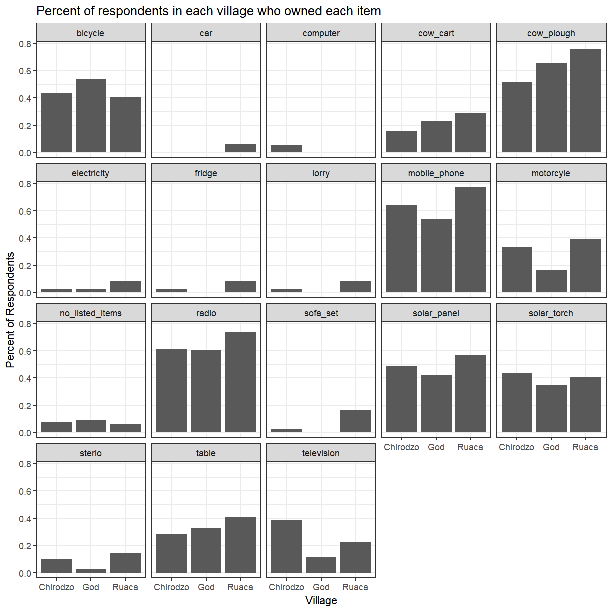
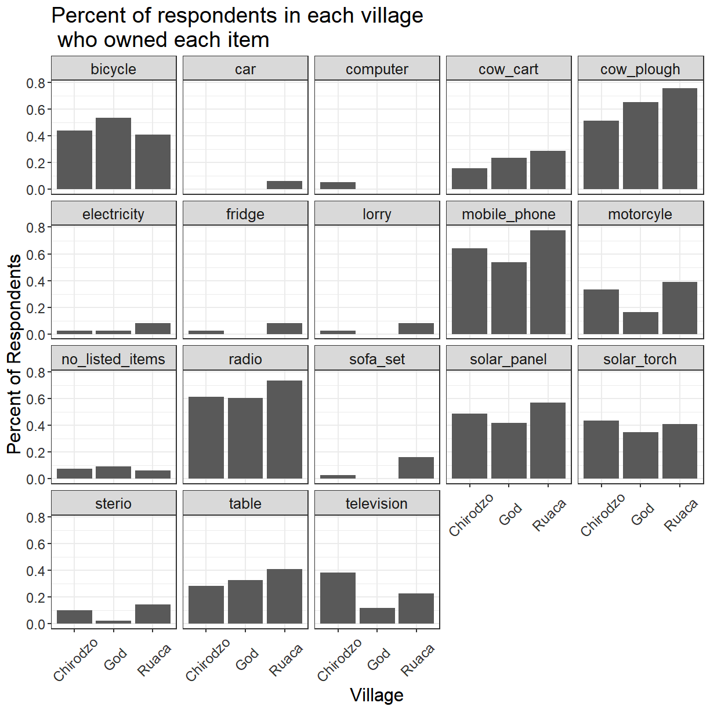
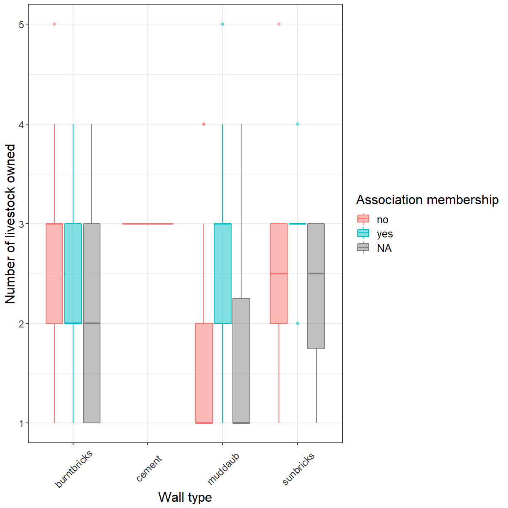

---
# Please do not edit this file directly; it is auto generated.
# Instead, please edit 03-customising-ggplots.md in _episodes_rmd/
title: "Customising plots created with ggplot2"
teaching: 60
exercises: 30
questions:
  - "How can I add custom titles and labels to my plot?"
  - "How can I combine multiple panels into a single plot?"
  - "How can I change the overall appearance of a plot?"
objectives:
   - "Change the default title and labels in a plot."
   - "Use facetting to increase the readability of complex plots."
   - "Use themes to adjust the overall appearance of a plot."
keypoints:
   - "ggplot2 allows plots to be customised in many ways."
   - "The appearance of plot elements can be adjusted individually or via themes."
---

We start by loading the required package. **`ggplot2`** is also included in the
**`tidyverse`** package.

~~~
library(tidyverse)
~~~
{: .language-r}

If you don't have the data loaded in your current R session you'll have
to import into R before you can proceed.

~~~
interviews_plotting <- read_csv("data_output/interviews_plotting.csv")
~~~
{: .language-r}

~~~
Parsed with column specification:
cols(
  .default = col_logical(),
  key_ID = col_integer(),
  village = col_character(),
  interview_date = col_datetime(format = ""),
  no_membrs = col_integer(),
  years_liv = col_integer(),
  respondent_wall_type = col_character(),
  rooms = col_integer(),
  memb_assoc = col_character(),
  affect_conflicts = col_character(),
  liv_count = col_integer(),
  items_owned = col_character(),
  no_meals = col_integer(),
  months_lack_food = col_character(),
  instanceID = col_character(),
  number_month_lack_food = col_integer(),
  number_items = col_integer()
)
~~~
{: .output}

~~~
See spec(...) for full column specifications.
~~~
{: .output}

## Adding Labels and Titles

By default, the axes labels on a plot are determined by the name of the variable
being plotted. This is a reasonable default but often not sufficient
for publication quality figures. However, **`ggplot2`** offers lots of customization options,
like specifying the axes labels, and adding a title to the plot with 
relatively few lines of code. We will add more informative *x* and *y* axis
labels to our plot of proportion of house type by village and also add
a title. In one of the previous lessons you've already seen how to
change the *y*-axis label with `ylab()`. Unsurprisingly, the *x*-axis
label can be changed with `xlab()`. The `ggtitle()` function allows you
to set the plot title. 

~~~
ggplot(data = interviews_plotting, aes(fill = respondent_wall_type, x = village)) +
    geom_bar(position = "fill") +
    stat_count(geom = "text", 
             aes(label = stat(count)),
             position=position_fill(vjust=0.5), colour="white") +
    ylab("Proportion") + xlab("Village") + ggtitle("Proportion of wall type by village")
~~~
{: .language-r}

## Customising legends

That is a bit better but the legend still uses the variable name as title. The
`guides()` function allows you to modify all aspects of the legends present
in the plot. Each plot can contain multiple guides, one for each aesthetic that
is mapped to a variable. In this bar plot the *fill* is mapped to `respondent_wall_type`.
This is a categorical variable, for which *ggplot* generates a legend (instead of
a color bar used for continuous variables). You'll use `guides(fill = guide_legend())`
to modify its appearance. 

~~~
ggplot(data = interviews_plotting, aes(fill = respondent_wall_type, x = village)) +
    geom_bar(position = "fill") +
    stat_count(geom = "text", 
             aes(label = stat(count)),
             position=position_fill(vjust=0.5), colour="white") +
    ylab("Proportion") + xlab("Village") + ggtitle("Proportion of wall type by village") +
    guides(fill=guide_legend(title = "Wall type"))
~~~
{: .language-r}

Using `guides()` allows you to easily modify modify many aspects of the legend.
However, it does not change the category labels because the legend simply
reflects the mapping of data values to visual properties. To change the
category labels you have to adjust that mapping directly. The functions
used to define the mapping all have names of the form `scale_<aesthetic>_<type>`.
Here you are dealing with a *discrete* scale for the *fill* aesthetic, so
the correct function to use is `scale_fill_discrete()`. The *labels* argument
allows you to set the category labels.

~~~
ggplot(data = interviews_plotting, aes(fill = respondent_wall_type, x = village)) +
    geom_bar(position = "fill") +
    stat_count(geom = "text", 
             aes(label = stat(count)),
             position=position_fill(vjust=0.5), colour="white") +
    ylab("Proportion") + xlab("Village") + ggtitle("Proportion of wall type by village") +
    scale_fill_discrete(labels = c("burnt bricks", "cement", "mud daub", "sun bricks")) + 
    guides(fill=guide_legend(title = "Wall type"))
~~~
{: .language-r}

## Faceting

Rather than creating a single plot with side-by-side bars you may want
to create multiple plots. This is especially true if you want to display
multiple variables at once.

**`ggplot2`** has a special technique called *faceting* that allows you to split one
plot into multiple panels based on a factor included in the dataset.
Let's use this to split a plot showing the relationship of irrigation association
membership and wall type for each of the villages. 

~~~
ggplot(data = interviews_plotting, aes(fill = memb_assoc, x = respondent_wall_type)) +
    geom_bar(position = "fill") +
    stat_count(geom = "text", 
             aes(label = stat(count)),
             position=position_fill(vjust=0.5), colour="white") +
    ylab("Proportion") + xlab("Village") + ggtitle("Proportion of irrigation association membership by village") +
    facet_wrap( ~ village)
~~~
{: .language-r}

As you can see this uses association membership to colour the bars
with one set of bars for each wall type and one panel per village.
While this is a generally useful technique, and would be even more
useful if you were dealing with data from more villages, the result 
in this particular case could be better. The three panels appear a 
bit cramped and the wall type labels are hard to read.

Let's try spreading the panels across two rows instead.

~~~
ggplot(data = interviews_plotting, aes(fill = memb_assoc, x = respondent_wall_type)) +
    geom_bar(position = "fill") +
    stat_count(geom = "text", 
             aes(label = stat(count)),
             position=position_fill(vjust=0.5), colour="white") +
    ylab("Proportion") + xlab("Village") + ggtitle("Proportion of irrigation association membership by village") +
    facet_wrap( ~ village, nrow = 2)
~~~
{: .language-r}

That looks a bit better. It also has the benefit of making the labels
a bit more readable. A good stratagey to deal with *x*-axis labels that
are to long for the available space is to rotate them by 45$^\circ$.

~~~
ggplot(data = interviews_plotting, aes(fill = memb_assoc, x = respondent_wall_type)) +
    geom_bar(position = "fill") +
    stat_count(geom = "text", 
             aes(label = stat(count)),
             position=position_fill(vjust=0.5), colour="white") +
    ylab("Proportion") + xlab("Village") + ggtitle("Proportion of irrigation association membership by village") +
    facet_wrap( ~ village, nrow = 2) +
    theme(axis.text.x = element_text(angle = 45, hjust = 1))
~~~
{: .language-r}

Click the "Zoom" button in your RStudio plots pane to view a larger
version of this plot.

Usually plots with white background look more readable when printed.  We can set
the background to white using the function `theme_bw()`. Additionally, you can remove
the grid:

~~~
ggplot(percent_wall_type, aes(x = respondent_wall_type, y = percent)) +
    geom_bar(stat = "identity", position = "dodge") +
    ylab("Percent") +
    xlab("Wall Type") +
    ggtitle("Proportion of wall type by village") +
    facet_wrap(~ village) +
    theme_bw() +
    theme(panel.grid = element_blank())
~~~
{: .language-r}

~~~
Error in ggplot(percent_wall_type, aes(x = respondent_wall_type, y = percent)): object 'percent_wall_type' not found
~~~
{: .error}

What if we wanted to see the proportion of respondents in each village
who owned a particular item? We can calculate the percent of people
in each village who own each item and then create a faceted series of
bar plots where each plot is a particular item. First we need to
calculate the percentage of people in each village who own each item:

~~~
percent_items <- interviews_plotting %>%
    gather(items, items_owned_logical, bicycle:no_listed_items) %>%
    filter(items_owned_logical) %>%
    count(items, village) %>%
    ## add a column with the number of people in each village
    mutate(people_in_village = case_when(village == "Chirodzo" ~ 39,
                                         village == "God" ~ 43,
                                         village == "Ruaca" ~ 49)) %>%
    mutate(percent = n / people_in_village)
~~~
{: .language-r}

To calculate this percentage data frame, we needed to use the `case_when()`
parameter within `mutate()`. In our earlier examples, we knew that each house
was one and only one of the types specified. However, people can (and do) own
more than one item, so we can't use the sum of the count column to give us the
denominator in our percentage calculation. Instead, we need to specify the
number of respondents in each village. Using this data frame, we can now create
a multi-paneled bar plot.

~~~
ggplot(percent_items, aes(x = village, y = percent)) +
    geom_bar(stat = "identity", position = "dodge") +
    facet_wrap(~ items) +
    theme_bw() +
    theme(panel.grid = element_blank())
~~~
{: .language-r}

## **`ggplot2`** themes

In addition to `theme_bw()`, which changes the plot background to white,
**`ggplot2`** comes with several other themes which can be useful to quickly
change the look of your visualization. The complete list of themes is available
at <http://docs.ggplot2.org/current/ggtheme.html>. `theme_minimal()` and
`theme_light()` are popular, and `theme_void()` can be useful as a starting
point to create a new hand-crafted theme.

The
[ggthemes](https://cran.r-project.org/web/packages/ggthemes/vignettes/ggthemes.html)
package provides a wide variety of options (including an Excel 2003 theme). The
[**`ggplot2`** extensions website](https://www.ggplot2-exts.org) provides a list
of packages that extend the capabilities of **`ggplot2`**, including additional
themes.

> ## Exercise
>
> Experiment with at least two different themes. Build the previous plot
> using each of those themes. Which do you like best?
{: .challenge}

## Customization

Take a look at the [**`ggplot2`** cheat
sheet](https://www.rstudio.com/wp-content/uploads/2016/11/ggplot2-cheatsheet-2.1.pdf),
and think of ways you could improve the plot.

Now, let's change names of axes to something more informative than 'village' and
'percent' and add a title to the figure:

~~~
ggplot(percent_items, aes(x = village, y = percent)) +
    geom_bar(stat = "identity", position = "dodge") +
    facet_wrap(~ items) +
    labs(title = "Percent of respondents in each village who owned each item",
         x = "Village",
         y = "Percent of Respondents") +
    theme_bw()
~~~
{: .language-r}

The axes have more informative names, but their readability can be improved by
increasing the font size:

~~~
ggplot(percent_items, aes(x = village, y = percent)) +
    geom_bar(stat = "identity", position = "dodge") +
    facet_wrap(~ items) +
    labs(title = "Percent of respondents in each village who owned each item",
         x = "Village",
         y = "Percent of Respondents") +
    theme_bw() +
    theme(text=element_text(size = 16))
~~~
{: .language-r}

Note that it is also possible to change the fonts of your plots. If you are on
Windows, you may have to install the [**`extrafont`**
package](https://github.com/wch/extrafont), and follow the instructions included
in the README for this package.

After our manipulations, you may notice that the values on the x-axis are still
not properly readable. Let's change the orientation of the labels and adjust
them vertically and horizontally so they don't overlap. You can use a 90-degree
angle, or experiment to find the appropriate angle for diagonally oriented
labels. With a larger font, the title also runs off. We can "\n" in the string
for the title to insert a new line:

~~~
ggplot(percent_items, aes(x = village, y = percent)) +
    geom_bar(stat = "identity", position = "dodge") +
    facet_wrap(~ items) +
    labs(title = "Percent of respondents in each village \n who owned each item",
         x = "Village",
         y = "Percent of Respondents") +
    theme_bw() +
    theme(axis.text.x = element_text(colour = "grey20", size = 12, angle = 45, hjust = 0.5, vjust = 0.5),
          axis.text.y = element_text(colour = "grey20", size = 12),
          text = element_text(size = 16))
~~~
{: .language-r}

If you like the changes you created better than the default theme, you can save
them as an object to be able to easily apply them to other plots you may create.
We can also add `plot.title = element_text(hjust = 0.5)` to center the title:

~~~
grey_theme <- theme(axis.text.x = element_text(colour = "grey20", size = 12, angle = 45, hjust = 0.5, vjust = 0.5),
                    axis.text.y = element_text(colour = "grey20", size = 12),
                    text = element_text(size = 16),
                    plot.title = element_text(hjust = 0.5))

ggplot(percent_items, aes(x = village, y = percent)) +
    geom_bar(stat = "identity", position = "dodge") +
    facet_wrap(~ items) +
    labs(title = "Percent of respondents in each village \n who owned each item",
         x = "Village",
         y = "Percent of Respondents") +
    grey_theme
~~~
{: .language-r}

> ## Exercise
>
> With all of this information in hand, please take another five minutes to
> either improve one of the plots generated in this exercise or create a
> beautiful graph of your own. Use the RStudio [**`ggplot2`** cheat sheet](https://www.rstudio.com/wp-content/uploads/2016/11/ggplot2-cheatsheet-2.1.pdf)
> for inspiration. Here are some ideas:
>
> * See if you can make the bars white with black outline.
> * Try using a different color palette (see
>   http://www.cookbook-r.com/Graphs/Colors_(ggplot2)/).
{: .challenge}

After creating your plot, you can save it to a file in your favorite format. The Export tab in the **Plot** pane in RStudio will save your plots at low resolution, which will not be accepted by many journals and will not scale well for posters.

Instead, use the `ggsave()` function, which allows you easily change the dimension and resolution of your plot by adjusting the appropriate arguments (`width`, `height` and `dpi`).

Make sure you have the `fig_output/` folder in your working directory.

~~~
my_plot <- ggplot(percent_items, aes(x = village, y = percent)) +
    geom_bar(stat = "identity", position = "dodge") +
    facet_wrap(~ items) +
    labs(title = "Percent of respondents in each village \n who owned each item",
         x = "Village",
         y = "Percent of Respondents") +
    theme_bw() +
    theme(axis.text.x = element_text(colour = "grey20", size = 12, angle = 45, hjust = 0.5, vjust = 0.5),
          axis.text.y = element_text(colour = "grey20", size = 12),
          text = element_text(size = 16),
          plot.title = element_text(hjust = 0.5))

ggsave("fig_output/name_of_file.png", my_plot, width = 15, height = 10)
~~~
{: .language-r}

Note: The parameters `width` and `height` also determine the font size in the saved plot.


