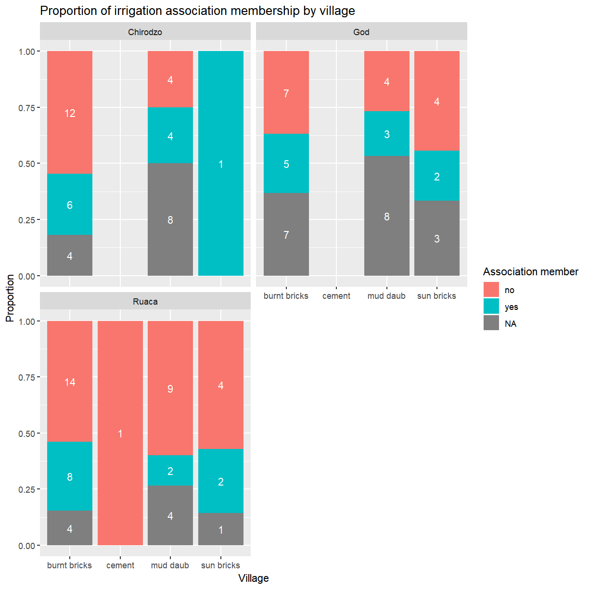
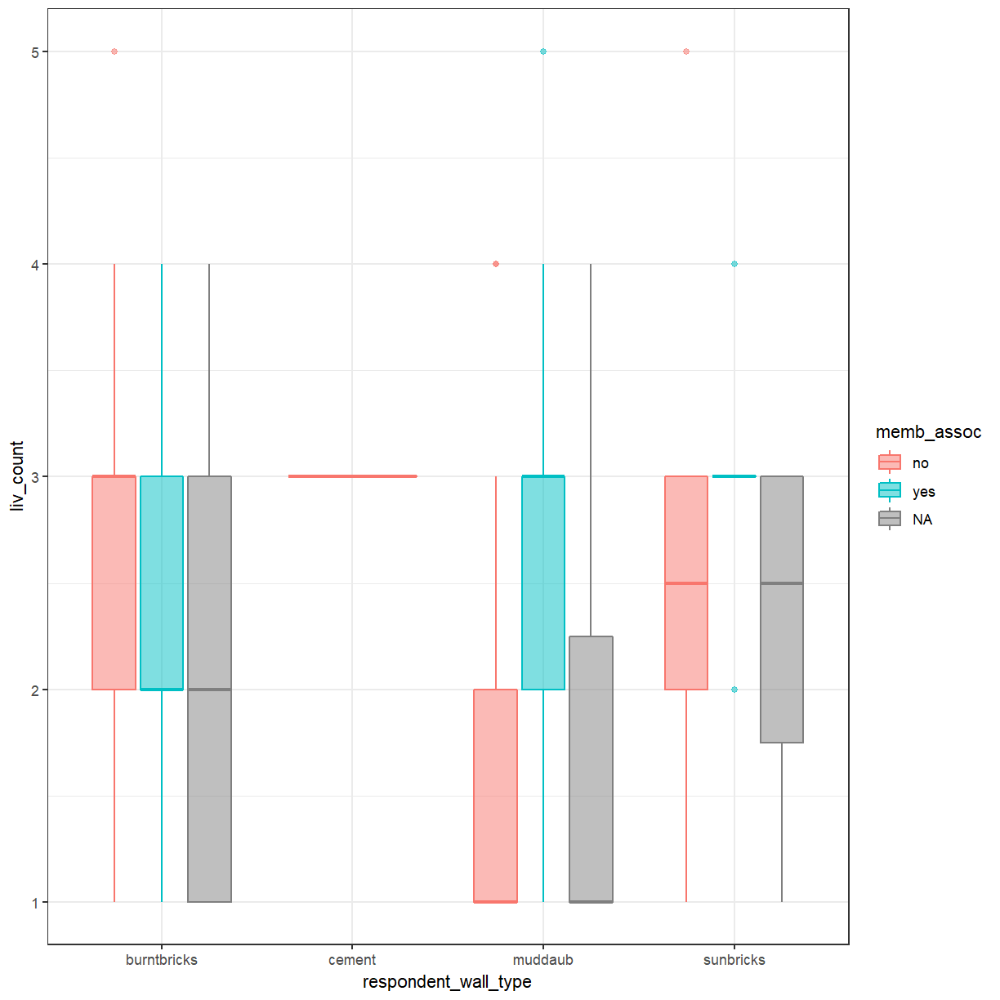
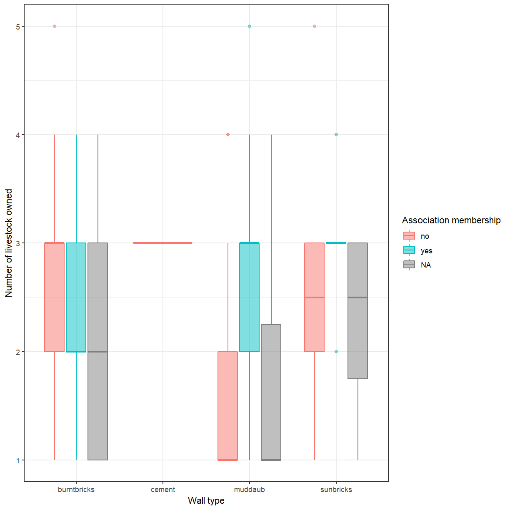
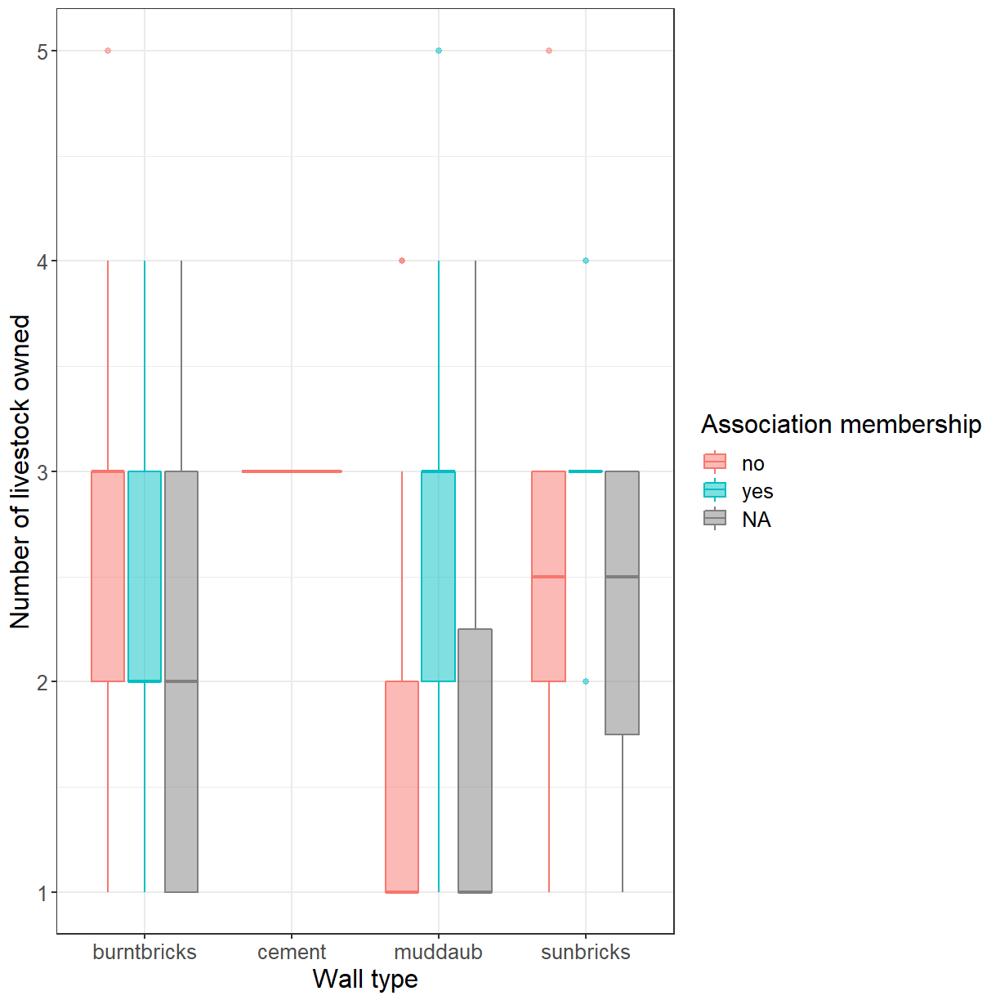

---
# Please do not edit this file directly; it is auto generated.
# Instead, please edit 03-customising-ggplots.md in _episodes_rmd/
title: "Customising plots created with ggplot2"
teaching: 60
exercises: 30
questions:
  - "How can I add custom titles and labels to my plot?"
  - "How can I combine multiple panels into a single plot?"
  - "How can I change the overall appearance of a plot?"
objectives:
   - "Change the default title and labels in a plot."
   - "Use facetting to increase the readability of complex plots."
   - "Use themes to adjust the overall appearance of a plot."
keypoints:
   - "ggplot2 allows plots to be customised in many ways."
   - "The appearance of plot elements can be adjusted individually or via themes."
---

We start by loading the required package. **`ggplot2`** is also included in the
**`tidyverse`** package.

~~~
library(tidyverse)
~~~
{: .language-r}

If you don't have the data loaded in your current R session you'll have
to import into R before you can proceed.

~~~
interviews_plotting <- read_csv("data_output/interviews_plotting.csv")
~~~
{: .language-r}

~~~
Parsed with column specification:
cols(
  .default = col_logical(),
  key_ID = col_integer(),
  village = col_character(),
  interview_date = col_datetime(format = ""),
  no_membrs = col_integer(),
  years_liv = col_integer(),
  respondent_wall_type = col_character(),
  rooms = col_integer(),
  memb_assoc = col_character(),
  affect_conflicts = col_character(),
  liv_count = col_integer(),
  items_owned = col_character(),
  no_meals = col_integer(),
  months_lack_food = col_character(),
  instanceID = col_character(),
  number_month_lack_food = col_integer(),
  number_items = col_integer()
)
~~~
{: .output}

~~~
See spec(...) for full column specifications.
~~~
{: .output}

## Adding Labels and Titles

By default, the axes labels on a plot are determined by the name of the variable
being plotted. This is a reasonable default but often not sufficient
for publication quality figures. However, **`ggplot2`** offers lots of customization options,
like specifying the axes labels, and adding a title to the plot with 
relatively few lines of code. We will add more informative *x* and *y* axis
labels to our plot of proportion of house type by village and also add
a title. In one of the previous lessons you've already seen how to
change the *y*-axis label with `ylab()`. Unsurprisingly, the *x*-axis
label can be changed with `xlab()`. The `ggtitle()` function allows you
to set the plot title. 

~~~
ggplot(data = interviews_plotting, aes(fill = respondent_wall_type, x = village)) +
    geom_bar(position = "fill") +
    stat_count(geom = "text", 
             aes(label = stat(count)),
             position=position_fill(vjust=0.5), colour="white") +
    ylab("Proportion") + xlab("Village") + ggtitle("Proportion of wall type by village")
~~~
{: .language-r}

## Customising legends

That is a bit better but the legend still uses the variable name as title. The
`guides()` function allows you to modify all aspects of the legends present
in the plot. Each plot can contain multiple guides, one for each aesthetic that
is mapped to a variable. In this bar plot the *fill* is mapped to `respondent_wall_type`.
This is a categorical variable, for which *ggplot* generates a legend (instead of
a color bar used for continuous variables). You'll use `guides(fill = guide_legend())`
to modify its appearance. 

~~~
ggplot(data = interviews_plotting, aes(fill = respondent_wall_type, x = village)) +
    geom_bar(position = "fill") +
    stat_count(geom = "text", 
             aes(label = stat(count)),
             position=position_fill(vjust=0.5), colour="white") +
    ylab("Proportion") + xlab("Village") + ggtitle("Proportion of wall type by village") +
    guides(fill=guide_legend(title = "Wall type"))
~~~
{: .language-r}

Using `guides()` allows you to easily modify modify many aspects of the legend.
However, it does not change the category labels because the legend simply
reflects the mapping of data values to visual properties. To change the
category labels you have to adjust that mapping directly. The functions
used to define the mapping all have names of the form `scale_<aesthetic>_<type>`.
Here you are dealing with a *discrete* scale for the *fill* aesthetic, so
the correct function to use is `scale_fill_discrete()`. The *labels* argument
allows you to set the category labels.

~~~
ggplot(data = interviews_plotting, aes(fill = respondent_wall_type, x = village)) +
    geom_bar(position = "fill") +
    stat_count(geom = "text", 
             aes(label = stat(count)),
             position=position_fill(vjust=0.5), colour="white") +
    ylab("Proportion") + xlab("Village") + ggtitle("Proportion of wall type by village") +
    scale_fill_discrete(labels = c("burnt bricks", "cement", "mud daub", "sun bricks")) + 
    guides(fill=guide_legend(title = "Wall type"))
~~~
{: .language-r}

## Facetting

Rather than creating a single plot with side-by-side bars you may want
to create multiple plots. This is especially true if you want to display
multiple variables at once.

**`ggplot2`** has a special technique called *faceting* that allows you to split one
plot into multiple panels based on a factor included in the dataset.
Let's use this to split a plot showing the relationship of irrigation association
membership and wall type for each of the villages. 

~~~
ggplot(data = interviews_plotting, aes(fill = memb_assoc, x = respondent_wall_type)) +
    geom_bar(position = "fill") +
    stat_count(geom = "text", 
             aes(label = stat(count)),
             position=position_fill(vjust=0.5), colour="white") +
    ylab("Proportion") + xlab("Wall type") + ggtitle("Proportion of irrigation association membership by wall type") +
    facet_wrap( ~ village)
~~~
{: .language-r}

As you can see this uses association membership to colour the bars
with one set of bars for each wall type and one panel per village.
While this is a generally useful technique, and would be even more
useful if you were dealing with data from more villages, the result 
in this particular case could be better. The three panels appear a 
bit cramped and the wall type labels are hard to read.

Let's try spreading the panels across two rows instead.

~~~
ggplot(data = interviews_plotting, aes(fill = memb_assoc, x = respondent_wall_type)) +
    geom_bar(position = "fill") +
    stat_count(geom = "text", 
             aes(label = stat(count)),
             position=position_fill(vjust=0.5), colour="white") +
    ylab("Proportion") + xlab("Wall type") + ggtitle("Proportion of irrigation association membership by wall type") +
    facet_wrap( ~ village, nrow = 2)
~~~
{: .language-r}

That looks a bit better. It also has the benefit of making the labels
a bit more readable. 

> ## Exercise
> 
> Adjust the legend title and wall type labels as you did before.
> Which `scale_*()` function do you have to use to adjust the labels now?
>
> > ## Solution
> >
> > 
> > ~~~
> > ggplot(data = interviews_plotting, aes(fill = memb_assoc, x = respondent_wall_type)) +
> >     geom_bar(position = "fill") +
> >     stat_count(geom = "text", 
> >              aes(label = stat(count)),
> >              position=position_fill(vjust=0.5), colour="white") +
> >     ylab("Proportion") + xlab("Village") + 
> >     ggtitle("Proportion of irrigation association membership by village") +
> >     scale_x_discrete(labels = c("burnt bricks", "cement", "mud daub", "sun bricks")) + 
> >     guides(fill=guide_legend(title = "Association member")) +
> >     facet_wrap( ~ village, nrow = 2)
> > ~~~
> > {: .language-r}
> > 
> > 
> {: .solution}
{: .challenge}

## Themes

A good stratagey to deal with *x*-axis labels that
are to long for the available space is to rotate them by 45$^\circ$.
The placement and appearance of the labels is controlled by the *theme*.
A *ggplot* theme determines the appearance of all parts of a plot that
aren't related to the data. Individual components of a theme can be
adjusted with the `theme()` function. This accepts optional arguments 
for all components. Values for these arguments are typically
functions with names of the form `element_<type>()`. To change the rotation
of the *x*-axis labels (`axis.text.x`) you'll need `element_text()`,
which allows you to set the angle. One other adjustment is needed. By
default the center of each text label is lined up with its corresponding
tick mark. That works well for horizontal labels but not once they
have been rotated. Set `hjust = 1` to align the end of the label
instead.

~~~
ggplot(data = interviews_plotting, aes(fill = memb_assoc, x = respondent_wall_type)) +
    geom_bar(position = "fill") +
    stat_count(geom = "text", 
             aes(label = stat(count)),
             position=position_fill(vjust=0.5), colour="white") +
    ylab("Proportion") + xlab("Village") + ggtitle("Proportion of irrigation association membership by village") +
    facet_wrap( ~ village, nrow = 2) +
    theme(axis.text.x = element_text(angle = 45, hjust = 1))
~~~
{: .language-r}

This approach is great if you just want to tweak one or two things. For
large scale changes this quickly becomes tedious. Fortunately, *ggplot*
provides several pre-defined themes that facilitate large-scale changes
to the appearance of a plot. 

Let's take a look at one of these. As you'll have noticed, *ggplot*
uses a grey background for plots. That works well enough on screen
but may be undesirable in print. You can set
the background to white using the function `theme_bw()`.

~~~
ggplot(data = interviews_plotting, aes(x = respondent_wall_type, y = liv_count, 
                                       fill = memb_assoc, color = memb_assoc)) +
  geom_boxplot(alpha = 0.5) +
  theme_bw()
~~~
{: .language-r}

In addition to `theme_bw()`, which changes the plot background to white,
**`ggplot2`** comes with several other themes which can be useful to quickly
change the look of your visualization. The complete list of themes is available
at [https://ggplot2.tidyverse.org/reference/ggtheme.html](https://ggplot2.tidyverse.org/reference/ggtheme.html).
`theme_minimal()` and `theme_light()` are popular, and `theme_void()` can be useful as a starting
point to create a new hand-crafted theme.

The
[ggthemes](https://cran.r-project.org/web/packages/ggthemes/vignettes/ggthemes.html)
package provides a wide variety of options (including an Excel 2003 theme). The
[**`ggplot2`** extensions website](https://www.ggplot2-exts.org) provides a list
of packages that extend the capabilities of **`ggplot2`**, including additional
themes.

> ## Exercise
>
> Experiment with at least two different themes. Build the previous plot
> using each of those themes. Which do you like best?
{: .challenge}

## Customization

> ## Exercise
> 
> You already know how to customise things like axis labels and point sizes.
> Change your plot to incorporate those changes.
>
> > ## Solution
> > 
> > ~~~
> > ggplot(data = interviews_plotting, aes(x = respondent_wall_type, y = liv_count, 
> >                                        fill = memb_assoc, color = memb_assoc)) +
> >   geom_boxplot(alpha = 0.5) + labs(x = "Wall type", y = "Number of livestock owned",
> >                                    fill="Association membership", 
> >                                    color="Association membership") +
> >   theme_bw()
> > ~~~
> > {: .language-r}
> > 
> > 
> {: .solution}
{: .challenge}

In addition to adjusting the lables you can also change the font and its size.
This can be usefulto improve readability and to meet the requirements
of a publisher. If you are on Windows, you may have to install the [**`extrafont`**
package](https://github.com/wch/extrafont), and follow the instructions included
in the README for this package.

> ## Exercise
> 
> Take a look at the [**`ggplot2`** cheat
> sheet](https://github.com/rstudio/cheatsheets/raw/master/data-visualization-2.1.pdf),
> or the [**`ggplot2`** reference](https://ggplot2.tidyverse.org/reference/index.html).
> Can you figure out how to change the font size.
>
> > ## Solution
> > 
> > 
> > ~~~
> > ggplot(data = interviews_plotting, aes(x = respondent_wall_type, y = liv_count, 
> >                                        fill = memb_assoc, color = memb_assoc)) +
> >   geom_boxplot(alpha = 0.5) + labs(x = "Wall type", y = "Number of livestock owned",
> >                                    fill="Association membership", 
> >                                    color="Association membership") +
> >   theme_bw() + theme(text=element_text(size = 16))
> > ~~~
> > {: .language-r}
> > 
> > 
> {: .solution}
{: .challenge}

If you like the changes you created better than the default theme, you can save
them as an object to be able to easily apply them to other plots you may create.
We can also add `plot.title = element_text(hjust = 0.5)` to center the title:

~~~
grey_theme <- theme(axis.text.x = element_text(colour = "grey20", size = 12, 
                    angle = 45, hjust = 0.5, vjust = 0.5),
                    axis.text.y = element_text(colour = "grey20", size = 12),
                    text = element_text(size = 16),
                    plot.title = element_text(hjust = 0.5))

ggplot(data = interviews_plotting, aes(x = respondent_wall_type, y = liv_count, 
                                       fill = memb_assoc, color = memb_assoc)) +
  geom_boxplot(alpha = 0.5) + labs(x = "Wall type", y = "Number of livestock owned",
                                   fill="Association membership", 
                                   color="Association membership") +
  theme_bw() + grey_theme
~~~
{: .language-r}

> ## Exercise
>
> With all of this information in hand, take some time to eplore the
> dataset. Can you identify an aspect of the data that may be interesting 
> to visualise? 
>
> Create an informative and visually appealing plot that showcases this
> aspect of the data. The [ggplot cheat sheet](https://github.com/rstudio/cheatsheets/raw/master/data-visualization-2.1.pdf)
> and the [R graph gallery](https://www.r-graph-gallery.com/) may provide some inspiration.
>
> **Note:** Feel free to transform the data or compute derived variables
> as necessary.
{: .challenge}


